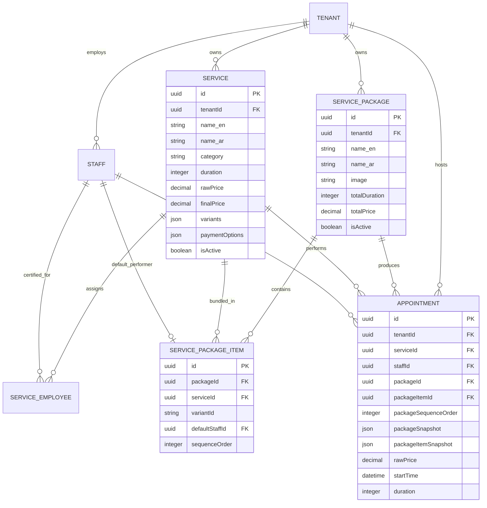
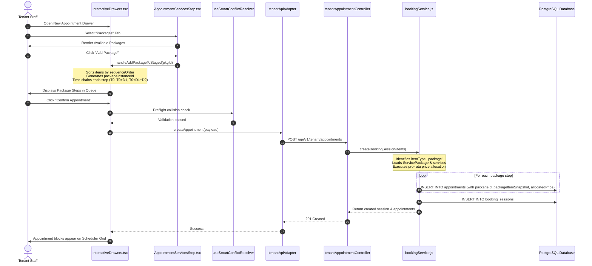

# Forensic Documentation: Tenant-v2 Services & Packages Current State

> **Document Status**: AUDIT & DISCOVERY BASELINE  
> **Repository Target**: `Tenant-v2` (Refah Luxury Salon Management Platform)  
> **Investigation Date**: September 16, 2026  
> **Verification Level**: Complete Code-Traced Forensic Audit (Zero Speculation)

---

# Executive Summary

This forensic document delivers an exhaustive, evidence-based technical audit of the **Services** and **Packages** architecture in the `Tenant-v2` web application and its supporting backend APIs within the `Bookingsystem` monorepo.

`Tenant-v2` is a single-page application built on React 18, TypeScript, and Vite. The application does not use traditional multi-page router libraries (like React Router DOM); instead, it implements a custom **tab-based workspace layout engine** managed in `App.tsx` and rendered through `Workspace.tsx`.

### High-Level Architectural Reality
1. **Services** are first-class, standalone operational entities representing individual spa/salon treatments (e.g., hair styling, massages, facials). They are managed via `ServicesWorkspace.tsx`, with a dual-view paradigm: an interactive filtered catalog (`list` view) and a four-stage progressive editor (`form` view). Services support pricing variants, retail gift cross-selling, staff assignment with custom commission rates, multi-channel payment acceptance policies, and AI-assisted bilingual copywriting.
2. **Packages** are bundled collections of existing services (e.g., "Bridal Glow Package"). They are managed via `PackagesWorkspace.tsx` and represent an ordered sequence of service treatments (`service_package_items`) that are executed consecutively. Packages are an entitlement-gated feature (`hasServicePackages`); their total price and duration are automatically derived on the backend by summing the constituent services and variants. The package editor does not allow manual pricing, custom discounts, or expiration dates.
3. **Information Architecture Relationship**: Services and Packages exist as **sibling modules** under the `operations` category in the tenant dashboard sidebar. Packages depend strictly on Services (a package cannot be created without at least one valid service), but Services are completely independent of Packages.
4. **Booking & Appointment Integration**: Both individual services and service packages can be scheduled into the tenant calendar via the appointment creation drawer (`InteractiveDrawers.tsx` / `AppointmentServicesStep.tsx`). While standalone services are added as single line items, adding a package automatically expands into ordered, time-chained service instances. When saved, the backend (`bookingService.createBookingSession`) generates **individual appointment records for every step in the package**, performing a deterministic pro-rata financial allocation of the package's total price across the created appointments. Each appointment on the scheduler timeline is marked with a package indicator and links back to the parent package and booking session.

---

# Repository / Feature Map

### 1. Root & Architecture
- **Tenant-v2 Root**: `d:\Waheed\Refah\Bookingsystem\Tenant-v2`
- **Backend Root**: `d:\Waheed\Refah\Bookingsystem\server`
- **Client Technology**: React 18, TypeScript, Vite, Tailwind CSS, Lucide React, Motion (`motion/react`)
- **Backend Technology**: Node.js, Express, Sequelize ORM, PostgreSQL

### 2. Core File Inventory

| File Path | Role | Layer | Scope | Key Consumers / Callers | Key Downstream Calls |
| :--- | :--- | :--- | :--- | :--- | :--- |
| `Tenant-v2/src/App.tsx` | Root Shell | Application Controller | Global | `main.tsx` | `Sidebar`, `Topbar`, `Workspace`, `TenantAuthContext` |
| `Tenant-v2/src/components/Sidebar.tsx` | Navigation Bar | UI Component | Global | `App.tsx` | Triggers `onSelectView('services')` and `onSelectView('packages')` |
| `Tenant-v2/src/components/Workspace.tsx` | View Host | UI Router/Switcher | Global | `App.tsx` | Mounts `ServicesWorkspace` and `PackagesWorkspace` |
| `Tenant-v2/src/components/ServicesWorkspace.tsx` | Feature Root | Page/Workspace | Services | `Workspace.tsx` | `tenantApiAdapter`, `serviceContract` |
| `Tenant-v2/src/components/PackagesWorkspace.tsx` | Feature Root | Page/Workspace | Packages | `Workspace.tsx` | `tenantApiAdapter`, `serviceContract` |
| `Tenant-v2/src/lib/serviceContract.ts` | Contract & Types | Model / Utility | Shared | `ServicesWorkspace`, `AppointmentWorkspace`, `tenantApiAdapter` | Image normalization, draft creation, payload serialization |
| `Tenant-v2/src/lib/tenantApiAdapter.ts` | HTTP Client | API Client | Global | All workspaces and hooks | Calls Express backend at `/api/v1/tenant/*` |
| `Tenant-v2/src/lib/tenantEntitlements.ts` | Entitlement Rules | Authorization | Global | `App.tsx`, `Sidebar.tsx`, `TenantAuthContext` | Evaluates feature flags such as `hasServicePackages` |
| `Tenant-v2/src/components/AppointmentWorkspace.tsx` | Scheduler Host | Workspace | Booking | `Workspace.tsx` | `SchedulerGrid`, `InteractiveDrawers` |
| `Tenant-v2/src/components/InteractiveDrawers.tsx` | Drawer Controller | UI Modal/Drawer | Booking & POS | `AppointmentWorkspace.tsx` | `AppointmentServicesStep`, `useAppointmentSubmission` |
| `Tenant-v2/src/components/appointment/AppointmentServicesStep.tsx` | Booking Step 3 | UI Step Component | Booking | `InteractiveDrawers.tsx` | `AppointmentServiceRow`, Package selection cards |
| `Tenant-v2/src/components/appointment/AppointmentServiceRow.tsx` | Service Line | UI Component | Booking | `AppointmentServicesStep.tsx` | `AppointmentServiceConfiguration` |
| `Tenant-v2/src/components/appointment/AppointmentServiceConfiguration.tsx` | Staged Config | UI Drawer/Form | Booking | `AppointmentServiceRow.tsx` | `useEarlyAvailabilityValidation` |
| `Tenant-v2/src/hooks/useAppointmentSubmission.ts` | Booking Hook | State / API Hook | Booking | `InteractiveDrawers.tsx` | `tenantApiAdapter.createAppointment` |
| `Tenant-v2/src/hooks/useEarlyAvailabilityValidation.ts` | Validation Hook | Realtime Check | Booking | `AppointmentServiceConfiguration.tsx` | `tenantApiAdapter.evaluateScheduling` |
| `Tenant-v2/src/hooks/useSmartConflictResolver.ts` | Conflict Hook | Collision Resolution | Booking | `InteractiveDrawers.tsx` | `fetchAvailabilityLayers`, `calculateAllValidChains` |
| `server/src/routes/tenantRoutes.js` | Express Routes | Backend Routing | Global | Express App (`server/src/index.js`) | Mounts `/tenant/services` and `/tenant/packages` |
| `server/src/controllers/tenantServiceController.js` | Service Controller | Backend Controller | Services | `tenantRoutes.js` | CRUD on `db.Service`, `db.ServiceEmployee`, Multer upload |
| `server/src/controllers/tenantPackageController.js` | Package Controller | Backend Controller | Packages | `tenantRoutes.js` | CRUD on `db.ServicePackage`, `db.ServicePackageItem` |
| `server/src/models/Service.js` | Sequelize Model | Data Model | Services | Controllers & Services | DB table `services` |
| `server/src/models/ServicePackage.js` | Sequelize Model | Data Model | Packages | Controllers & Services | DB table `service_packages` |
| `server/src/models/ServicePackageItem.js` | Sequelize Model | Data Model | Packages | Controllers & Services | DB table `service_package_items` |
| `server/src/services/bookingService.js` | Booking Engine | Business Logic | Booking | `tenantAppointmentController.js` | Atomic creation, pro-rata pricing, calendar collision checking |

---

# Services — Complete Functional Description

## 3.1 Service Entry Point
- **Navigation Path**: User logs into the tenant dashboard (`/dashboard`), expands or navigates the left sidebar (`Sidebar.tsx`), and clicks on the navigation button under the **`operations`** category with the `Sparkles` icon labeled **"الخدمات"** (Arabic) or **"Services"** (English).
- **Tab State**: Clicking this item triggers `onSelectView('services')` in `App.tsx`. If a tab named `tab-services` is already open, it activates it; otherwise, it appends a new tab to `tabs` and marks it active.
- **Initial View**: `Workspace.tsx` renders `<ServicesWorkspace lang={lang} quickLaunchRequest={quickLaunchRequest} />`. The initial view mode is `activeView = 'list'`.
- **Alternative Entry Points**:
  1. **Global Search (`GlobalSearch.tsx`)**: Pressing `Ctrl+K` or `Cmd+K` and searching for services opens a direct launcher.
  2. **Top Bar Quick Action**: Quick launch dropdown triggering `handleQuickAction('service')`.

## 3.2 Services Page Structure (`list` view)
When `activeView === 'list'`, the workspace renders:
1. **Top Status / Entitlement Header**:
   - Displays plan usage chip (`planSummary`): Shows current plan name (e.g., "الصالون المحترف" or "Professional Salon") and an indicator showing used vs. quota services: e.g., `تم استخدام 14 من أصل 25 خدمات` (`serviceUsage` of `formatTenantPlanLimit(serviceLimit)`).
2. **Search & Filter Action Bar**:
   - **Text Search Field**: Input with magnifying glass icon. Filters in real-time by searching `nameAr`, `nameEn`, `descriptionAr`, `descriptionEn`, and variant names.
   - **Gender Filter Dropdown**: Options: `All Genders` (`كل الجماهير`), `Females Only` (`نساء فقط`), `Males Only` (`رجال فقط`).
   - **Status Filter Dropdown**: Options: `All Status` (`كل الحالات`), `Active Only` (`نشط`), `Inactive Only` (`غير نشط`).
   - **Sort Dropdown**: Options: `Default Sorting` (`ترتيب افتراضي`), `Price: Low to High` (`السعر: من الأقل للأعلى`), `Price: High to Low` (`السعر: من الأعلى للأقل`), `Duration: Shortest` (`الوقت: الأقصر أولاً`), `Duration: Longest` (`الوقت: الأطول أولاً`).
   - **"Add New Service" (`إضافة خدمة جديدة`) Button**: Opens the creation form (`activeView = 'form'`, `formMode = 'add'`). If subscription service quota is exhausted (`isLimitReached = true`), the button is disabled with gray styling and a `cursor-not-allowed` indicator.
3. **Subscription Quota Warning Banner**:
   - If `isLimitReached === true`, an amber warning alert (`AlertTriangle`) informs the user: *"لقد وصلت للحد الأقصى للخدمات مسبقة التفعيل في باقتك الحالية"* and prompts an upgrade or archiving existing services.
4. **Two-Column Main Catalog**:
   - **Left Column (3 of 12 cols)**:
     - **Category Navigation Card**: Displays all registered categories from `tenantApiAdapter.getServiceCategories()`, prepended by an "All Categories" (`كل الفئات`) option. Each option shows its real-time item count badge (`getCategoryCount(cat.id)`).
     - **Promotional Filter Checkboxes**:
       - `offerFilter`: Checkbox for *"الخدمات ذات العروض الخاصة"* (Services with Special Offers).
       - `giftFilter`: Checkbox for *"الخدمات المرفقة بهدايا عينية"* (Services with Free Gifts).
   - **Right Column (9 of 12 cols)**:
     - **Category Header**: Displays current active category title, matching count badge, and a **"Sync Catalog"** (`مزامنة الكتالوج`) button with a rotating refresh animation.
     - **Service Card Stack**: Rendered list of horizontal cards for each service.

## 3.3 Services Tab / Sub-Navigation
Inside the list view, sub-filtering is executed through:
- Category list items on the left.
- Genders, statuses, and promotional checkboxes.
There are no separate sub-pages or secondary tabs in the list view; all filtering is performed dynamically in local memory on the fetched `services` array.

## 3.4 Service Creation Flow (`activeView === 'form'`, `formMode === 'add'`)
Clicking "Add New Service" resets the draft state via `createEmptyServiceDraft(defaultCategory)` and switches the workspace to a full-screen guided editor layout with a 4-step progressive navigation rail.

### Step 1: Basic Info & Identity (`basic`)
- **AI Content Generator Button**: Analyzes the entered name and generates bilingual descriptions.
- **Service Name (Arabic) `name_ar` / `nameAr`**: Text input (Required).
- **Service Name (English) `name_en` / `nameEn`**: Text input (Required).
- **Detailed Description (Arabic) `description_ar`**: Textarea with AI English-to-Arabic translation trigger.
- **Detailed Description (English) `description_en`**: Textarea with AI Arabic-to-English translation trigger.
- **Category `category`**: Select dropdown populated from `serviceCategories` (falls back to predefined system categories).
- **Session Duration `duration`**: Numeric input in minutes (default: `60`).
- **Target Audience `targetGender`**: Segmented button group (`all`, `female`, `male`).
- **Pricing Type `priceType`**: Segmented button group (`fixed` or `free`).
- **Base Price `finalPrice` / `rawPrice`**: Numeric input in SAR. Required if `priceType !== 'free'`.

### Step 2: Service Performers (`team`)
- Fetches all active tenant staff (`employees`).
- Renders each employee with their avatar, localized name, and role.
- **Assignment Checkbox**: Toggles employee inclusion in `employeeAssignments`.
- **Custom Commission Option**:
  - When checked, overrides global staff commission.
  - **Type**: Dropdown selecting percentage (`%`) or flat amount (`SAR`).
  - **Value**: Numeric input (default: `10`).

### Step 3: Includes & Upgrades (`options`)
- **Service Perks (`includes`)**:
  - Input field for perks (e.g., "Complimentary herbal tea" / "ضيافة شاي أعشاب").
  - Badges render with "X" to remove. Saved as an array of strings.
- **Pricing Variants & Upgrades (`variants`)**:
  - Allows defining multi-tiered options (e.g., "Extend massage by 30 mins").
  - Fields: Arabic Name, English Name, Arabic Description, English Description, Additional Price (SAR), Additional Duration (mins), "Active and Bookable" toggle.
  - Stored in `variants` array as `ServiceVariantRecord`.
- **Complimentary Retail Gift Attachment (`hasGift`)**:
  - Checkbox: "Attach Complimentary Gift with This Booking".
  - Dropdown: Selects product from tenant inventory (`products` table via `giftProductId`).
  - Bilingual gift notes: `giftDetailsAr` and `giftDetailsEn`.
- **Service Cover Image**:
  - Drag-and-drop / file browser upload (PNG, JPG, WEBP up to 5MB).
  - Can select from preset stock spa photography or upload custom file.
  - Generates a local `FileReader` preview and appends `image` (binary `File` or existing URL).
- **Special Promotional Discount (`hasOffer`)**:
  - Checkbox: "Enable Special Promotion".
  - Fields: Discount percentage (`offerDiscountPct`), Expiration date (`offerTo`), Arabic offer notes (`offerDetailsAr`), English offer notes (`offerDetailsEn`).

### Step 4: Channels & Policies (`settings`)
- **Accepted Payment Channels (`paymentOptions`)**:
  - Three card toggles:
    1. `at-center`: Cash / Card at Center (`الدفع المباشر داخل فرع الصالون`).
    2. `online-full`: Full Pre-payment Online (`سداد كامل القيمة عبر البوابة الإلكترونية`).
    3. `booking-fee`: Guaranteed Deposit (`دفع عربون تأمين لضمان الحضور`).
- **Operational Toggles**:
  - `isActive`: Boolean (Active and Open for Bookings).
  - `availableInCenter`: Boolean (Available for In-Center Visits).
  - `availableHomeVisit`: Boolean (Available for Home Services).
  - `allowReschedule`: Boolean (Allow Customer Rescheduling).

### Form Submission & Lifecycle
- Validates required fields (`name_ar`, `name_en`, and price if not free).
- If an image file was selected, packages payload as `multipart/form-data`; otherwise, sends JSON payload via `buildServicePayload`.
- Calls `POST /api/v1/tenant/services`.
- On success: Prepends new service to `services`, triggers success toast, resets form state, returns to `list` view.

## 3.5 Service Editing Flow (`formMode === 'edit'`)
- Triggered by clicking the pencil icon on any service card.
- Sets `selectedServiceId = srv.id`, loads all existing fields into `formData`, populates `variants`, `includes`, `employeeAssignments`, and `employeeCommissions`.
- Preserves the existing image unless a new image file is chosen.
- Submits via `PUT /api/v1/tenant/services/:id`.
- Updates the service in the local `services` array and returns to `list` view.

## 3.6 Service Details
`Tenant-v2` does not implement a dedicated full-page service detail view. Instead, detailed operational data is inspected directly from the list card (which displays image, category, gender, duration, specialist count, tags, price) or by opening the comprehensive Edit form.

## 3.7 Service Lifecycle Operations
- **Create**: Fully implemented (`POST /tenant/services`).
- **Edit**: Fully implemented (`PUT /tenant/services/:id`).
- **Activate / Deactivate**: Implemented via card toggle button (`handleToggleActiveStatus`). Updates local state and can be persisted through edit save.
- **Delete**: Fully implemented (`DELETE /tenant/services/:id`). Triggers backend `service.destroy()`, cascades employee associations, removes image files from disk, and removes item from UI state.
- **Archive / Restore / Duplicate / Bulk Actions**: **NOT IMPLEMENTED**. No duplicate button or multi-select bulk delete/edit controls exist in the current UI code.

---

# Packages — Complete Functional Description

## 4.1 Package Entry Point
- **Navigation Path**: Sidebar button located under the **`operations`** category with the `PackagePlus` icon labeled **"الباقات"** (Arabic) or **"Packages"** (English).
- **Entitlement Guard**: In `Sidebar.tsx`, the menu item is wrapped in an entitlement check:
  ```tsx
  if (!hasServicePackages) {
    itemsInCat = itemsInCat.filter((i) => i.id !== 'packages');
  }
  ```
  If the tenant's plan lacks `hasServicePackages`, the Packages navigation item is completely hidden from the sidebar.
- **Workspace State**: Handled in `Workspace.tsx` when `view === 'packages'`, rendering `<PackagesWorkspace lang={lang} />`.
- **Alternative Entry**: Quick create or deep link action with `type: 'packages'`.

## 4.2 Package Page Structure (`list` view)
When `activeView === 'list'`, `PackagesWorkspace.tsx` displays:
1. **Header**:
   - Title: "Service Packages" / "باقات الخدمات".
   - Subtitle: "Manage bundled service packages for your customers." / "إدارة الباقات المجمعة لعملائك.".
   - **"Add Package" (`إضافة باقة`) Button**: Opens the creation form.
2. **State Displays**:
   - **Loading State**: Displays centered text `"Loading packages..."`.
   - **Empty State**: Displays centered `Package` icon, title *"No packages yet"* / *"لا توجد باقات بعد"*, and description *"Create your first package to get started"*.
   - **Loaded Grid**: Responsive 3-column grid (`grid-cols-1 md:grid-cols-2 lg:grid-cols-3`).

### Package Card Components
Each card in the grid renders:
- **Thumbnail Image**: Shows image from `pkg.image` (resolved via `resolveServiceImageUrl`) or a gray placeholder with a centered `Package` icon.
- **Hover Quick Actions**:
  - **Edit Button** (`Edit` icon): Opens package in edit mode (`openForm('edit', pkg)`).
  - **Delete Button** (`Trash2` icon): Prompts browser confirmation (`confirm(...)`) and calls `deletePackage(pkg.id)`.
- **Card Content**:
  - Localized Title (`name_ar` if RTL, `name_en` if LTR).
  - **Total Price**: Derived price from backend (`parseFloat(pkg.totalPrice).toFixed(2)` SAR).
  - **Total Duration**: Derived duration (`pkg.totalDuration` min).
  - **Included Services Count**: Footer text showing `pkg.items?.length Included Services` (`خدمات مضمنة`).

## 4.3 Package Tabs
`PackagesWorkspace` does **not** have category tabs, subtabs, or search filters. All packages for the tenant are displayed in a single unified grid.

## 4.4 Package Creation Flow (`formMode === 'add'`)
Clicking "Add Package" switches the workspace view to `activeView = 'form'`.

### Section 1: Package Information (`معلومات الباقة`)
- **Package Name (English) `name_en`**: Text input (Required).
- **Package Name (Arabic) `name_ar`**: Text input (Required).
- **Package Image**: File upload drop area accepting `image/*`. Displays preview thumbnail upon selection.

### Section 2: Package Services (`خدمات الباقة`)
- Header with **"Add Service" (`إضافة خدمة`)** button.
- If items list is empty, displays a dashed notice: *"No services added. This package will be empty."*.
- Adding a service appends an object: `{ serviceId: '', variantId: '', defaultStaffId: '', sequenceOrder: items.length }`.
- **Per-Item Controls**:
  - **Reorder Arrows (▲ / ▼)**: Shifts item up or down in sequence order (`moveItem(index, 'up')` / `moveItem(index, 'down')`).
  - **Service Dropdown**: Populated from all active catalog services (`s.name_ar` / `s.name_en`).
    - *Auto-Reset Logic*: If the selected staff member is not certified/assigned to the newly selected service, `defaultStaffId` is automatically cleared.
  - **Variant Dropdown (Optional)**: Disabled if the selected service has no variants. If variants exist, allows selecting `-- Base --` or any specific variant (`v.name_ar` / `v.name_en`).
  - **Default Staff Dropdown (Optional)**: Defaults to `-- Any Staff --` (`-- أي موظف --`). Dynamically filtered to show **only** employees assigned to the selected service (`allowedStaff.includes(String(emp.id))`).
  - **Remove Item (`Trash2`)**: Deletes the row from the package.
- **Execution Order Callout**:
  - An informational badge informs the tenant: *"ملاحظة: سيتم حجز هذه الخدمات للعميل بنفس الترتيب المحدد أعلاه تباعاً (أ ب ج)"* (*Note: These services will be booked for the customer in the exact sequential order defined above (A B C)*).

### Form Submission & Validation
- Validation requires:
  1. `nameEn` is non-empty.
  2. `nameAr` is non-empty.
  3. `items.length > 0`.
  4. Every item has a non-empty `serviceId`.
- Serializes data into `FormData`:
  - `name_en`
  - `name_ar`
  - `items[i][serviceId]`
  - `items[i][variantId]`
  - `items[i][defaultStaffId]`
  - `items[i][sequenceOrder]`
  - `image` (binary file if selected).
- Calls `POST /api/v1/tenant/packages`.

## 4.5 Package / Service Relationship & Architecture
1. **Referential Integrity**:
   - Packages do **not** duplicate service records. They link to services via foreign keys in the `service_package_items` table (`serviceId`, `variantId`, `defaultStaffId`, `packageId`).
2. **Cardinality & Duplication**:
   - A package can contain multiple services.
   - The **same service can appear more than once** in a package (e.g., a manicure step followed later by another touch-up step). Each instance receives its own unique row in `service_package_items` with its own `sequenceOrder`.
3. **Derived Pricing & Duration Calculation**:
   - In the frontend form, **there are no price or duration input fields**.
   - When `createPackage` or `updatePackage` is executed on the backend (`tenantPackageController.js`), the server loads the current service and variant records from the database:
     ```javascript
     let itemPrice = parseFloat(srv.finalPrice || srv.calculateFinalPrice());
     let itemDuration = parseInt(srv.duration, 10) || 0;
     if (item.variantId && srv.variants) {
         const variant = srv.variants.find(v => v.id === item.variantId);
         if (variant) {
             itemPrice = parseFloat(variant.price || itemPrice);
             itemDuration = parseInt(variant.duration, 10) || itemDuration;
         }
     }
     totalPrice += itemPrice;
     totalDuration += itemDuration;
     ```
   - The calculated `totalPrice` and `totalDuration` are stored directly on the `service_packages` record.
4. **Behavior on Service Modification or Deletion**:
   - *If a Service is Edited*: The package's stored `totalPrice` and `totalDuration` remain static until the package is re-saved or booked. However, when an appointment is booked through `bookingService.createBookingSession`, the backend fetches the **live** service prices to compute pro-rata allocation.
   - *If a Service is Deleted*: Because `service_package_items.serviceId` references `services(id)` without `ON DELETE CASCADE`, attempting to delete a service that belongs to an active package will trigger a database foreign key constraint error.
5. **Redemption & Validity Rules**:
   - **NOT IMPLEMENTED**: The current implementation does not feature expiration periods, usage caps, redemption limits, customer-specific eligibility, or branch restrictions.

## 4.6 Package Editing Flow (`formMode === 'edit'`)
- Triggered by clicking the pencil icon on a package card.
- Populates `currentPackageId`, `nameEn`, `nameAr`, `imagePreview`, and converts `pkg.items` into the editable items array.
- Submits via `PUT /api/v1/tenant/packages/:id`.
- On the backend, `updatePackage` runs within a database transaction: it deletes all existing `service_package_items` associated with the package, recalculates `totalPrice` and `totalDuration`, and bulk-creates the updated package items.

## 4.7 Package Details
There is no separate read-only package details page. The package card provides summary information, and clicking edit opens the full configuration form.

## 4.8 Package Lifecycle Operations
- **Create**: Fully implemented (`POST /tenant/packages`).
- **Edit**: Fully implemented (`PUT /tenant/packages/:id`).
- **Deactivate / Soft Delete**: Implemented via `DELETE /tenant/packages/:id`, which sets `pkg.isActive = false`.
- **Hard Delete / Restore / Duplicate / Bulk Operations**: **NOT IMPLEMENTED**.

---

# Services vs Packages — Current Information Architecture

The following matrix clarifies the exact architectural relationship between Services and Packages in `Tenant-v2`:

| Architectural Dimension | Services | Packages |
| :--- | :--- | :--- |
| **Entity Nature** | Standalone atomic treatment | Composite ordered bundle of treatments |
| **Sidebar Position** | Sibling under `operations` category (`Sparkles` icon) | Sibling under `operations` category (`PackagePlus` icon) |
| **Entitlement Requirement** | Standard platform feature (governed by `maxServices` limit) | Gated feature (`hasServicePackages` / `servicePackages`) |
| **Dependency** | Independent (does not require Packages) | Dependent (requires existing catalog Services) |
| **Pricing Model** | Fixed or Free; configured manually by tenant | Automatically derived sum of constituent services & variants |
| **Duration Model** | Configured manually per service (in minutes) | Automatically derived sum of constituent durations |
| **Staff Model** | Multi-staff assignment with optional custom commissions | Single default staff assignment per step |
| **Promotions & Gifts** | Supports discount % (`hasOffer`) & free retail gift (`hasGift`) | None (inherits constituent service characteristics) |
| **Categories** | Assigned to explicit categories (`massage`, `skincare`, etc.) | None (packages do not have categories) |
| **Booking Representation** | Booked as an individual appointment line item | Expanded into multiple consecutive chained appointments |

---

# Appointment / Booking Integration

The scheduling and appointment creation system (`InteractiveDrawers.tsx`, `AppointmentServicesStep.tsx`, `bookingService.js`) represents the primary point of convergence between Services and Packages.

```
[Tenant User]
      │
      ▼
Opens Appointment Drawer ("New Appointment" / Click Calendar Slot)
      │
      ├─► Step 1: Customer Selection (Existing / Walk-in)
      ├─► Step 2: Date & Base Professional Selection
      │
      ▼
Step 3: Service & Package Selection (`AppointmentServicesStep.tsx`)
      │
      ├───► [Tab: Services]
      │         │
      │         ├── Search & Category filtering
      │         ├── Click "Add" on Service or Variant
      │         ├── Expands `AppointmentServiceConfiguration`
      │         │     ├─ Staff member selection
      │         │     ├─ Early availability check (`useEarlyAvailabilityValidation`)
      │         │     ├─ Discount (Flat / Percent)
      │         │     └─ Start time & duration override
      │         └─► Appends 1 item to `stagedServices` (`itemType: 'service'`)
      │
      └───► [Tab: Packages]
                │
                ├── Displays Available Packages (`servicePackages` array)
                ├── User clicks "Add Package" (`handleAddPackageToStaged(pkgId)`)
                │
                ├── Sorting: Sorts package items by `sequenceOrder`
                ├── Instance Generation: Creates unique `packageInstanceId`
                │
                └── Time-Chaining Expansion:
                      Iterates over package items:
                      - Item 1: `startTime = baseTime`, `duration = D1`
                      - Item 2: `startTime = baseTime + D1`, `duration = D2`
                      - Item 3: `startTime = baseTime + D1 + D2`, `duration = D3`
                      Appends N items to `stagedServices` (`itemType: 'package'`)
```

### 1. The Package Staging Process in `InteractiveDrawers.tsx`
When a tenant clicks "Add Package", `handleAddPackageToStaged(pkgId)` executes:
1. Locates package from `servicePackages`.
2. Generates a unique `packageInstanceId = "pkg_" + Date.now() + "_" + random`.
3. Sorts items strictly by `sequenceOrder`.
4. Loops through items and matches each against `canonicalServices`.
5. Resolves assigned staff (`item.defaultStaffId || currentStaffId`).
6. Computes start times sequentially:
   - The first step begins at `currentStartTime`.
   - Each subsequent step's start time is chained: `runningStartTime += previousStep.duration`.
7. Each item is pushed into `stagedServices` with:
   - `itemType: 'package'`
   - `packageInstanceId`: Ties the group together in the UI.
   - `packageId`: ID of the parent package.
   - `packageItemId`: ID of the specific step row in `service_package_items`.
   - `serviceId`, `variantId`, `staffId`, `duration`, `basePrice`, `startTime`.

### 2. Multi-Service Availability & Collision Validation
- Before final submission, the system runs preflight conflict validation via `useSmartConflictResolver.ts`.
- Calls `fetchAvailabilityLayers` to inspect working shifts, breaks, time-offs, and existing bookings for each professional across each step.
- If conflicts are detected:
  - Opens `SmartConflictModal.tsx` / `chainConflictDialog`.
  - Displays conflict cards detailing why a stylist is unavailable (e.g., existing booking, staff break, overtime candidate).
  - Offers auto-calculated conflict-free sequential chains or enables splitting into separate appointments.

### 3. Submission Payload Format
When confirming appointment creation, `InteractiveDrawers.tsx` formats the payload:
- Standalone services become `{ itemType: 'service', serviceId, staffId, startTime, duration, price, discountType, discountValue }`.
- Package items are grouped by `packageInstanceId`:
  ```json
  {
    "itemType": "package",
    "packageId": "pkg-uuid",
    "packageItems": [
      {
        "packageItemId": "item-uuid-1",
        "serviceId": "service-uuid-1",
        "staffId": "staff-uuid-1",
        "startTime": "2026-06-27T14:30:00.000Z",
        "duration": 60,
        "sequenceOrder": 0
      },
      {
        "packageItemId": "item-uuid-2",
        "serviceId": "service-uuid-2",
        "staffId": "staff-uuid-2",
        "startTime": "2026-06-27T15:30:00.000Z",
        "duration": 45,
        "sequenceOrder": 1
      }
    ]
  }
  ```
- Submits to `POST /api/v1/tenant/appointments`.

### 4. Backend Booking Execution (`bookingService.createBookingSession`)
Upon receiving a package item, the backend executes a **deterministic pro-rata price distribution**:
1. Verifies `servicePackage` exists and `isActive === true`.
2. Sums the live base prices of all constituent services (`totalBasePrice`).
3. Calculates pro-rata allocated price for each step:
   $$\text{ratio} = \frac{\text{step.basePrice}}{\text{totalBasePrice}}$$
   $$\text{allocatedPrice} = \text{round}(\text{ratio} \times \text{packageTotalPrice}, 2)$$
4. Any rounding remainder is added to the highest-priced service step.
5. Creates a **distinct `Appointment` record for each package step**:
   - `appointment.packageId = servicePackage.id`
   - `appointment.packageItemId = step.pItem.packageItemId`
   - `appointment.packageSequenceOrder = step.pItem.sequenceOrder`
   - `appointment.packageSnapshot = { packageId, packageNameEn, packageNameAr, packagePrice, packageDuration }`
   - `appointment.packageItemSnapshot = { packageItemId, serviceId, serviceNameEn, serviceNameAr, allocatedPrice, duration }`
   - `appointment.rawPrice = step.allocatedPrice`
   - Shared `bookingSessionId` and `bookingReference`.

### 5. Timeline Grid Representation (`SchedulerGrid.tsx`)
Because the backend creates separate appointments for each step, each step appears on the scheduler grid as an independent event positioned in its assigned professional's column and scheduled time slot. Appointments with `packageId` or `packageSnapshot` display an amber package icon (`<Package size={10} className="inline mr-1 text-amber-600" />`).

---

# API / Data Flow Trace

### Service Management Flow
```
[User Action: Create Service]
   │
   ▼
ServicesWorkspace.tsx (handleSaveService)
   │
   ▼
tenantApiAdapter.createService(payload)
   │ (HTTP POST /api/v1/tenant/services)
   ▼
Express Route: tenantRoutes.js
   ├── requireActiveSubscription
   ├── checkResourceLimit('maxServices')
   └── uploadImage (Multer middleware)
   │
   ▼
tenantServiceController.createService
   ├── Fetch global tax and commission rates (db.GlobalSettings)
   ├── Calculate rawPrice and finalPrice
   ├── Validate assigned employees (db.Staff where tenantId)
   ├── Create Service row (db.Service.create)
   ├── Create Employee associations (db.ServiceEmployee.bulkCreate)
   └── Return { success: true, service }
   │
   ▼
tenantApiAdapter normalizes with normalizeServiceRecord()
   │
   ▼
ServicesWorkspace state updated: setServices([newService, ...prev])
```

### Package Management Flow
```
[User Action: Create Package]
   │
   ▼
PackagesWorkspace.tsx (savePackage)
   │
   ▼
tenantApiAdapter.createPackage(formData)
   │ (HTTP POST /api/v1/tenant/packages)
   ▼
Express Route: tenantRoutes.js
   ├── requireActiveSubscription
   ├── requireFeature('hasServicePackages')
   ├── checkResourceLimit('package')
   └── uploadImage (Multer middleware)
   │
   ▼
tenantPackageController.createPackage
   ├── Verify all services belong to tenant (db.Service.findAll)
   ├── Calculate totalPrice and totalDuration from services/variants
   ├── Create Package row (db.ServicePackage.create)
   ├── Create Items rows (db.ServicePackageItem.bulkCreate)
   └── Return { success: true, package }
   │
   ▼
PackagesWorkspace refreshes list via fetchData()
```

---

# State Management

| State Item | Scope / Location | Type / Structure | Description |
| :--- | :--- | :--- | :--- |
| `activeView` | `App.tsx` & `Workspace.tsx` | `'dashboard' \| 'services' \| 'packages' \| ...` | Controls the active main view |
| `packageEntitlements` | `TenantAuthContext.tsx` | `Record<string, any>` | Stores subscription feature entitlements (e.g., `hasServicePackages`) |
| `services` | `ServicesWorkspace.tsx` | `EnhancedService[]` | In-memory catalog of services fetched from API |
| `serviceCategories` | `ServicesWorkspace.tsx` | `ServiceCategoryOption[]` | Category options fetched from `/tenant/services/categories` |
| `formData` | `ServicesWorkspace.tsx` | `ServiceDraft` | Active service editor draft state |
| `activeSection` | `ServicesWorkspace.tsx` | `'basic' \| 'team' \| 'options' \| 'settings'` | Current step in service creation wizard |
| `searchQuery` | `ServicesWorkspace.tsx` | `string` | Live search filter in services list |
| `selectedCategory` | `ServicesWorkspace.tsx` | `string` (`'all'` or category slug) | Active category filter |
| `packages` | `PackagesWorkspace.tsx` | `any[]` | Array of packages fetched from `/tenant/packages` |
| `items` (package items) | `PackagesWorkspace.tsx` | `Array<{ serviceId, variantId, defaultStaffId, sequenceOrder }>` | Staged items in package editor form |
| `stagedServices` | `InteractiveDrawers.tsx` | `StagedService[]` | Staged services and package items in appointment creation drawer |
| `activeTab` | `AppointmentServicesStep.tsx` | `'services' \| 'packages'` | Toggle between services and packages in booking step |

---

# Permissions & Roles

### Role Hierarchy & Elevated Access
In `TenantAuthContext.tsx`, permissions are governed by role keys:
```typescript
export function isElevatedDashboardRoleKey(roleKey?: string | null): boolean {
  if (!roleKey) return false;
  const normalized = String(roleKey).trim().toLowerCase();
  return normalized.includes('admin') || normalized.includes('owner') || normalized.includes('super');
}
```
- **Tenant Owner / Admin / Manager**:
  - Full access to view, create, edit, and delete Services.
  - Full access to manage Packages (if plan entitlement allows).
  - Can authorize booking overtime.
- **Receptionist / Staff**:
  - Can view services and packages in the appointment scheduling drawer.
  - Cannot approve overtime bookings unless granted explicit administrative permissions.

### Subscription & Entitlement Guards
- **Services Limit**: Backend route `/tenant/services` enforces `checkResourceLimit('maxServices')`. The UI checks `isLimitReached` and disables the "Add New Service" button if `serviceUsage >= serviceLimit`.
- **Packages Feature Access**: Backend route `/tenant/packages` enforces `requireFeature('hasServicePackages')`. The UI checks `hasServicePackagesEntitlement(packageEntitlements)` to display or hide the Packages sidebar navigation.

---

# UI / Screen Inventory

```
App Shell (App.tsx)
 ├── Topbar (Topbar.tsx)
 └── Sidebar (Sidebar.tsx)
      ├── Operations Group
      │    ├── Services Nav Item (id: 'services', icon: Sparkles)
      │    └── Packages Nav Item (id: 'packages', icon: PackagePlus) [Entitlement Gated]
      │
      └── Workspace (Workspace.tsx)
           │
           ├── ServicesWorkspace (ServicesWorkspace.tsx)
           │    ├── List View (`activeView === 'list'`)
           │    │    ├── Header (Plan quota summary chip)
           │    │    ├── Search & Filter Bar (Search, Gender, Status, Sort, Add Button)
           │    │    ├── Subscription Limit Banner (if quota reached)
           │    │    └── Main Catalog (2-Column Grid)
           │    │         ├── Left Column: Category Filter List & Promo Checkboxes
           │    │         └── Right Column: Service Cards Stack
           │    │              └── Service Card (Image, badges, titles, duration, staff count, price, activate/edit/delete buttons)
           │    │
           │    └── Form View (`activeView === 'form'`)
           │         ├── Header Bar (Back button, title, cancel/save buttons)
           │         ├── Left Column: 4-Step Progress Navigation
           │         │    ├── Step 1: Basic Info (25%)
           │         │    ├── Step 2: Team Members (50%)
           │         │    ├── Step 3: Includes & Upgrades (75%)
           │         │    └── Step 4: Channels & Policies (100%)
           │         └── Right Column: Active Step Form Inputs
           │
           ├── PackagesWorkspace (PackagesWorkspace.tsx)
           │    ├── List View (`activeView === 'list'`)
           │    │    ├── Header (Title, subtitle, "Add Package" button)
           │    │    ├── Empty State / Loading State
           │    │    └── Packages Grid (3-column responsive cards)
           │    │         └── Package Card (Image, edit/delete buttons, title, price, duration, included count)
           │    │
           │    └── Form View (`activeView === 'form'`)
           │         ├── Header Bar (Back button, title, "Save" button)
           │         ├── Card 1: Package Info (name_en, name_ar, image upload)
           │         └── Card 2: Package Services List (Add button, reorder arrows, service select, variant select, staff select, remove button)
           │
           └── Appointment Creation Drawer (InteractiveDrawers.tsx)
                └── Step 3: AppointmentServicesStep.tsx
                     ├── Tab Toggle: ['Services' | 'Packages']
                     ├── [Services Tab]: Categories, search, AppointmentServiceRow
                     └── [Packages Tab]:
                          ├── "Selected Packages" panel (with step execution rows)
                          └── "Available Packages" cards (Add Package button)
```

---

# States and Edge Cases

| Area | State | Implemented Behavior | Evidence File |
| :--- | :--- | :--- | :--- |
| **Services List** | Loading | Skeleton loading state triggered during data load | `Workspace.tsx:104` |
| **Services List** | Empty | Centered card: *"No Catalog Services Found"*, button to add first service | `ServicesWorkspace.tsx:881` |
| **Services List** | Quota Reached | "Add New Service" button disabled; amber warning banner displayed | `ServicesWorkspace.tsx:850` |
| **Services List** | No Search Matches | Filter reset prompt: *"عذراً، لم نعثر على نتائج مطابقة"* | `ServicesWorkspace.tsx:1001` |
| **Service Form** | Validation Errors | Field-level error messages beneath input; toast alert | `ServicesWorkspace.tsx:484` |
| **Packages List** | Loading | Centered text: *"Loading packages..."* | `PackagesWorkspace.tsx:227` |
| **Packages List** | Empty | Centered box: *"No packages yet"*, *"Create your first package to get started"* | `PackagesWorkspace.tsx:229` |
| **Package Form** | Missing Service | Validation blocks submit: *"Please select a service for all package items"* | `PackagesWorkspace.tsx:152` |
| **Package Form** | Uncertified Staff | Selecting a new service automatically resets `defaultStaffId` if uncertified | `PackagesWorkspace.tsx:396` |
| **Booking Step** | Package No Services | Toast warning: *"The package contains no services"* | `InteractiveDrawers.tsx:1574` |
| **Booking Step** | Staff Conflict | `SmartConflictModal` displays diagnostic reason; offers sequential chain alternatives | `useSmartConflictResolver.ts:146` |

---

# Responsive / RTL / Accessibility

1. **RTL Support**:
   - Controlled globally by `lang === 'ar'` via `dir={isRtl ? 'rtl' : 'ltr'}` on container elements.
   - Text alignment classes (`text-left rtl:text-right`), margin/padding start utilities (`marginInlineStart`, `ps-`, `pe-`).
   - Arrow icons (e.g., `<ArrowLeft className={isRtl ? "rotate-180" : ""} />`) correctly invert direction.
2. **Responsive Layouts**:
   - **Desktop**: 12-column grid in Services (`lg:col-span-3` filters / `lg:col-span-9` results) and 3-column card grid in Packages.
   - **Tablet / Mobile**: Left filter collapses into full-width stacked blocks; package cards stack into 1 or 2 columns (`grid-cols-1 md:grid-cols-2`).
3. **Accessibility**:
   - Form inputs have associated `<label>` tags with descriptive text.
   - Buttons include localized tooltips (`title`) and `aria-label` attributes where text is omitted.

---

# Complete User Journeys

### Journey A: Create a Service
1. **Action**: Tenant clicks "Services" in the sidebar (`Sidebar.tsx`).
2. **Screen**: Services list view opens with active catalog.
3. **Action**: Tenant clicks "Add New Service" button.
4. **Screen**: 4-step progressive service creation form opens (`ServicesWorkspace.tsx`).
5. **Action**: In Step 1, tenant enters Arabic & English service names, selects category, inputs duration (60 mins), and base price (250 SAR). Clicks "Next".
6. **Action**: In Step 2, tenant checks two certified staff members and sets a 15% custom commission for one. Clicks "Next".
7. **Action**: In Step 3, tenant adds an inclusion item ("Complimentary Green Tea"), defines a 30-min upgrade variant, and uploads an image. Clicks "Next".
8. **Action**: In Step 4, tenant selects accepted payment channels (`at-center`, `online-full`) and confirms the service is active.
9. **Action**: Tenant clicks "Deploy Changes" / "تنشيط الخدمة في الكتالوج".
10. **Result**: API call `POST /api/v1/tenant/services` succeeds. Success toast fires, and user is returned to the list view where the new service card is immediately visible.

### Journey B: Edit a Service
1. **Action**: Tenant locates an existing service in the catalog and clicks the pencil icon.
2. **Screen**: Form view opens in edit mode (`formMode === 'edit'`) populated with current data.
3. **Action**: Tenant updates the duration from 60 to 75 minutes and adjusts the price.
4. **Action**: Tenant clicks "Save Changes" (`حفظ التعديلات`).
5. **Result**: API call `PUT /api/v1/tenant/services/:id` executes. Service record updates in local state, success toast appears, and catalog returns to list view.

### Journey C: Delete / Deactivate a Service
1. **Deactivation Flow**: Tenant clicks the "Deactivate" (`تعطيل`) button on the service card. Local state immediately switches to inactive with a confirmation toast.
2. **Delete Flow**: Tenant clicks the trash icon on the service card.
3. **Result**: API call `DELETE /api/v1/tenant/services/:id` executes. Backend permanently deletes the record, cascades employee assignments, removes the image from disk, and removes the card from the UI.

### Journey D: Create a Package
1. **Action**: Tenant clicks "Packages" in the sidebar.
2. **Screen**: Packages list view opens.
3. **Action**: Tenant clicks "Add Package" button.
4. **Screen**: Package creation form opens (`PackagesWorkspace.tsx`).
5. **Action**: Tenant enters English name ("Bridal Bliss Package") and Arabic name ("باقة نعيم العروس"). Uploads an image.
6. **Action**: In the "Package Services" section, tenant clicks "Add Service" twice:
   - Row 1: Selects "Moroccan Hammam", leaves variant as Base, selects specific staff member.
   - Row 2: Selects "Deep Cleansing Facial", selects "Hydration Boost" variant, leaves staff as Any Staff.
7. **Action**: Tenant uses the up/down arrows to ensure Moroccan Hammam is first in sequence.
8. **Action**: Tenant clicks "Save".
9. **Result**: API call `POST /api/v1/tenant/packages` sends `FormData`. Server sums durations and prices, creates `ServicePackage` and `ServicePackageItem` records. List view refreshes with new package card showing combined price and duration.

### Journey E: Edit a Package
1. **Action**: Tenant hovers over a package card and clicks the pencil icon.
2. **Screen**: Form view opens populated with package title, image, and items.
3. **Action**: Tenant adds a third service step or changes the default assigned staff.
4. **Action**: Tenant clicks "Save".
5. **Result**: API call `PUT /api/v1/tenant/packages/:id` executes. Server replaces items within a transaction, recalculates total duration and price, and updates catalog.

### Journey F: Delete / Deactivate a Package
1. **Action**: Tenant hovers over a package card and clicks the trash icon.
2. **Screen**: Browser confirmation prompt appears: *"Are you sure you want to delete this package?"*.
3. **Action**: Tenant confirms.
4. **Result**: API call `DELETE /api/v1/tenant/packages/:id` executes. Backend soft-deletes the package (`isActive = false`). Card is removed from list view.

### Journey G: Create an Appointment Using a Service
1. **Action**: Tenant clicks a slot on the timeline grid or clicks "New Appointment".
2. **Screen**: `InteractiveDrawers.tsx` opens. Tenant selects customer and date.
3. **Action**: In Step 3 (`AppointmentServicesStep.tsx`), tenant stays on the "Services" tab, searches for "Massage", and clicks "Add".
4. **Screen**: Row expands into `AppointmentServiceConfiguration`. Early availability check verifies staff availability.
5. **Action**: Tenant selects stylist and verifies time slot. Clicks "Next" and proceeds to Step 4 (Payment/Summary).
6. **Action**: Tenant confirms booking.
7. **Result**: API call `POST /api/v1/tenant/appointments` submits single service item. Backend creates appointment record. Timeline grid updates with the new booking block.

### Journey H: Create an Appointment Using a Package
1. **Action**: Tenant opens the New Appointment drawer, selects customer and date.
2. **Action**: In Step 3, tenant toggles the tab from "Services" to **"Packages"**.
3. **Screen**: Grid of available packages is displayed.
4. **Action**: Tenant clicks "Add Package" on "Bridal Bliss Package".
5. **Screen**:
   - `handleAddPackageToStaged` executes.
   - The package expands into sequential chained steps.
   - "Selected Packages" panel appears showing "Bridal Bliss Package" and individual rows for Moroccan Hammam (14:30 - 15:30) and Facial (15:30 - 16:15).
6. **Action**: Tenant reviews execution steps and clicks "Next".
7. **Action**: Tenant confirms booking.
8. **Result**: API call `POST /api/v1/tenant/appointments` sends package group. Backend creates **two separate appointments** linked by `packageId` and `bookingSessionId`, allocating pro-rata pricing. Both appointments appear on the scheduler grid with amber package badges.

---

# Current Screen / Route Matrix

| Feature | Screen / View | Route / ViewId | Entry Point | Parent Container | Main Actions | API / Adapter Methods | Auth / Entitlement Guard | Status |
| :--- | :--- | :--- | :--- | :--- | :--- | :--- | :--- | :--- |
| **Services** | Catalog List | `services` | Sidebar Menu | `Workspace.tsx` | Search, filter by category/gender/status, sort, toggle active, delete | `getServices`, `getServiceCategories`, `deleteService` | `maxServices` resource quota | IMPLEMENTED |
| **Services** | Guided Form | `services` (`activeView='form'`) | "Add New Service" / Card Edit | `ServicesWorkspace.tsx` | 4-step wizard, AI generation, variant management, staff assignments, image upload | `createService`, `updateService` | `maxServices` quota check on create | IMPLEMENTED |
| **Packages** | Packages Grid | `packages` | Sidebar Menu | `Workspace.tsx` | View cards, delete package, trigger edit | `getPackages`, `deletePackage` | `hasServicePackages` entitlement | IMPLEMENTED |
| **Packages** | Package Form | `packages` (`activeView='form'`) | "Add Package" / Card Edit | `PackagesWorkspace.tsx` | Input names, upload image, add/reorder/remove service items, select default staff | `createPackage`, `updatePackage` | `hasServicePackages` & `package` limit | IMPLEMENTED |
| **Booking** | Service Step | Drawer Step 3 | New Appointment flow | `InteractiveDrawers.tsx` | Toggle services/packages, search, stage items, configure timing/staff | `getServices`, `getPackages`, `evaluateScheduling` | Authenticated tenant user | IMPLEMENTED |

---

# Current Functional Matrix

| Capability | Services Status | Packages Status | Current Code Behavior | Primary File Reference |
| :--- | :--- | :--- | :--- | :--- |
| **Creation** | IMPLEMENTED | IMPLEMENTED | Services use 4-step wizard; Packages use 2-section form | `ServicesWorkspace.tsx`, `PackagesWorkspace.tsx` |
| **Editing** | IMPLEMENTED | IMPLEMENTED | Both support in-place form modification and PUT endpoints | `tenantServiceController.js`, `tenantPackageController.js` |
| **Deletion** | IMPLEMENTED | IMPLEMENTED | Service performs hard delete; Package performs soft delete (`isActive = false`) | `tenantServiceController.js:883`, `tenantPackageController.js:321` |
| **Search** | IMPLEMENTED | NOT IMPLEMENTED | Services have real-time text query; Packages grid has no search field | `ServicesWorkspace.tsx:697` |
| **Category Filter** | IMPLEMENTED | NOT IMPLEMENTED | Services filter by category sidebar; Packages have no category system | `ServicesWorkspace.tsx:903` |
| **Manual Price Input**| IMPLEMENTED | NOT IMPLEMENTED | Service price is manual/free; Package price is auto-calculated on backend | `PackagesWorkspace.tsx:143`, `tenantPackageController.js:136` |
| **Pricing Variants** | IMPLEMENTED | REFERENCED | Services create variants; Package items can select a variant of a service | `serviceContract.ts:254`, `PackagesWorkspace.tsx:415` |
| **Custom Duration** | IMPLEMENTED | NOT IMPLEMENTED | Service duration is explicit; Package duration is auto-calculated sum | `tenantPackageController.js:175` |
| **Staff Assignment** | IMPLEMENTED | IMPLEMENTED | Service assigns multiple staff; Package sets 1 default staff per step | `ServicesWorkspace.tsx:1508`, `PackagesWorkspace.tsx:432` |
| **Sequential Booking**| NOT APPLICABLE | IMPLEMENTED | Packages enforce sequential execution ordering (▲ / ▼) in appointment drawer | `InteractiveDrawers.tsx:1592`, `bookingService.js:806` |
| **Pro-Rata Financials**| NOT APPLICABLE | IMPLEMENTED | Backend allocates package price across created appointments pro-rata | `bookingService.js:754` |
| **Bulk Operations** | NOT IMPLEMENTED | NOT IMPLEMENTED | No bulk delete, bulk export, or bulk status toggles exist | Audited in both workspaces |

---

# Mermaid Diagrams

### 1. Data Architecture & Entity Relationships


### 2. Appointment Booking & Package Expansion Pipeline


---

# Evidence / File References

Every assertion in this report is derived from the following audited source code:

1. **Routing & Entitlements**:
   - `Tenant-v2/src/App.tsx` (Lines 413–426, 548–558, 649–658)
   - `Tenant-v2/src/components/Sidebar.tsx` (Lines 140–146, 208–267)
   - `Tenant-v2/src/data/translations.ts` (Lines 60–74)
   - `Tenant-v2/src/lib/tenantEntitlements.ts` (Lines 79–84)
2. **Services Workspace**:
   - `Tenant-v2/src/components/ServicesWorkspace.tsx` (Lines 56–87, 339–357, 469–581, 696–726, 1288–2180)
   - `Tenant-v2/src/lib/serviceContract.ts` (Lines 25–70, 295–365, 429–465)
3. **Packages Workspace**:
   - `Tenant-v2/src/components/PackagesWorkspace.tsx` (Lines 47–64, 70–97, 143–187, 307–469)
4. **Appointment Integration**:
   - `Tenant-v2/src/components/InteractiveDrawers.tsx` (Lines 1570–1650, 1830–1960)
   - `Tenant-v2/src/components/appointment/AppointmentServicesStep.tsx` (Lines 75–110, 175–350)
   - `Tenant-v2/src/components/appointment/AppointmentServiceRow.tsx` (Lines 51–130)
   - `Tenant-v2/src/components/appointment/AppointmentServiceConfiguration.tsx` (Lines 38–174)
   - `Tenant-v2/src/hooks/useEarlyAvailabilityValidation.ts` (Lines 34–90)
   - `Tenant-v2/src/hooks/useSmartConflictResolver.ts` (Lines 47–150)
   - `Tenant-v2/src/components/SchedulerGrid.tsx` (Lines 54, 1034)
5. **Backend Controllers & Engine**:
   - `server/src/routes/tenantRoutes.js` (Lines 133–160)
   - `server/src/controllers/tenantServiceController.js` (Lines 327–384, 436–640, 880–934)
   - `server/src/controllers/tenantPackageController.js` (Lines 37–73, 118–212, 214–319, 321–353)
   - `server/src/models/ServicePackage.js` (Lines 24–74)
   - `server/src/models/ServicePackageItem.js` (Lines 24–73)
   - `server/src/controllers/tenantAppointmentController.js` (Lines 825–945)
   - `server/src/services/bookingService.js` (Lines 720–825)

---

# Unknowns / Areas Not Established

1. **Service Deletion Safeguard**: While the database schema enforces a foreign key constraint from `service_package_items.serviceId` to `services.id`, `tenantServiceController.deleteService` does not pre-check if a service is currently part of an active package before calling `service.destroy()`. Whether Postgres throws a constraint error or silently fails depends on migration-level database constraint triggers.
2. **Gift Card Packages Disambiguation**: The repository contains both `ServicePackage` (`/tenant/packages`) and `GiftCardPackage` (`/tenant/gift-cards/packages`). In `AppointmentWorkspace.tsx`, both are loaded into separate states. Care must be taken not to confuse Gift Card denomination packages with Service treatment packages.

---

## Audit Conclusion

The current `Tenant-v2` Services and Packages systems are fully implemented, functional, and deeply integrated with the platform's backend and scheduler. 

- **Services** are mature, featuring rich metadata (bilingual descriptions, categories, variants, employee commissions, inclusions, gifts, and payment options).
- **Packages** serve specifically as sequential treatment bundles, with prices and durations automatically derived from their member services.
- **Booking Integration** is fully realized: packages in appointments expand into chained sequential steps, and upon confirmation, generate discrete appointments with pro-rata price allocation.

This completes the read-only forensic investigation in accordance with the task specification. No source files were modified.
