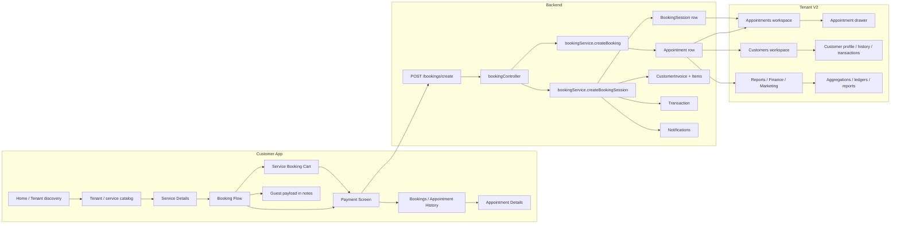

# REFAH Booking Architecture Audit

**Scope**

- Customer App: `RifahMobile/`
- Backend: `server/`
- Original Tenant Dashboard: `tenant/`
- Tenant V2: `Tenant-v2/`

**Intent**

This document is an architecture discovery audit only.  
No code was modified while producing this report.

---

## 1) Booking Architecture Diagram



### Key architectural principle

The live system is **session-aware**:

- One **BookingSession**
- Many **Appointment** rows inside that session
- One canonical **invoice / payment / transaction aggregation** per booking session when appropriate

Guest data is not modeled as a separate canonical database entity in the inspected code.  
It is passed through the booking request and stored in appointment notes using a structured marker.

---

## 2) Booking Lifecycle

### End-to-end sequence

1. Customer opens the salon storefront.
2. Customer browses services, staff, reviews, and gift cards.
3. Customer opens a service detail page or the booking cart.
4. Customer chooses a time, staff member, and payment method.
5. Customer may add a guest/group booking payload.
6. Customer submits booking.
7. Backend creates a booking session and one or more appointment rows.
8. Backend creates the invoice / payment snapshots / notifications.
9. Customer sees confirmation.
10. Appointment history and appointment details screens later replay the booking using session-aware grouping.

### Customer App screen flow

| Screen | Purpose | Inputs | Validation | APIs called | Data collected | DTO / payload generated | Navigation |
|---|---|---|---|---|---|---|---|
| `HomeScreen` | Discovery and entry into the marketplace | Language, search, featured services, categories | Minimal UI validation | `getHotDeals`, `getCategories`, `getTenants`, `getTrendingTenants`, `getTopProviders`, `getCustomerAppContent` | Salon discovery selection | None | Opens salon / tenant page |
| `TenantScreen` | Salon storefront / service catalog | Tenant slug/id, service selection, product selection, gift card entry point | Requires valid tenant and service/product availability | Public tenant APIs | Salon, services, staff, products, reviews, gift cards | Tenant catalog state | Leads to `ServiceDetails`, `Cart`, `ServiceBookingCart`, `Gifts` |
| `ServiceDetailsScreen` | Single-service detail and booking entry | Service, staff, time, tenant | Service must exist and belong to tenant | Public service endpoint | Service detail, staff options | Booking seed state | Pushes into `BookingFlow` |
| `BookingFlow` | Final booking wizard for single service | Service, staff, date, time, notes, payment choice, optional guest info | Required service, staff/time rules, payment rule checks | `POST /bookings/create`, `GET /public/tenant/:slug`, `GET /public/tenant/:tenantId/services/:serviceId/staff` | Booking note, guest payload, payment choice | Booking request body with `groupGuest` and booking metadata | On success: confirmation modal; optional `PaymentScreen` |
| `ServiceBookingCartScreen` | Multi-service cart checkout | Multiple service items, shared booking session/reference, guest payload | Shared session/reference consistency checks | `POST /bookings/create`, `GET /payments/sources`, `GET /payments/wallet/balance` | Combined booking items | Booking session create payload | On success: `PaymentScreen` if payable |
| `PaymentScreen` | Collect payment for booking / booking session | appointmentId, bookingSessionId, amount, payment method, tenant | Payment source validation and amount checks | `POST /payments/process`, payment source APIs | Payment method, card/wallet metadata | Payment request body | Returns to appointments / purchases on success |
| `BookingsScreen` | Customer booking history | Tabs, filters | Tab state and record grouping | `GET /users/bookings` or fallback `GET /bookings?platformUserId=...` | Historical bookings, grouped by session/reference | History grouping model | Opens `AppointmentDetailsScreen` |
| `AppointmentDetailsScreen` | Replay of a booking or booking session | Booking, session, guest data, timeline notes | Booking must be selected | History data already loaded, local parse helpers | Appointment summary, payment status, guest card, timeline | Read-only view model | Contact, reschedule, cancel, add service |
| `MoreScreen` | Personal account hub | Profile, notifications, purchases, wallet | Basic app auth | `getUser`, `getProfile`, `getNotifications` | Customer identity and account links | None | Navigates to profile, gifts, settings |
| `GiftsScreen` | Gift card / wallet flows | Recipient, wallet, package, claim code | Recipient / code validation | Wallet and gift endpoints | Gift card purchase, wallet balance, history | Gift / wallet request DTO | Returns to app hub or purchase history |

### Notes on navigation

- The customer app uses a **single canonical booking backend** but exposes several entry points:
  - salon page
  - service details page
  - cart page
  - booking flow
  - payment screen
  - appointment history / details screens
- The app also supports invitation / deep-link flows through appointment invite screens.

---

## 3) Booking Data Model

### Canonical booking-related entities

| Entity | Owner | Main fields observed in code | Relations | Database tables | DTOs / frontend models |
|---|---|---|---|---|---|
| `BookingSession` | Backend | `id`, `bookingReference`, `tenantId`, `platformUserId`, `status`, `itemCount`, `subtotal`, `taxAmount`, `platformFee`, `totalAmount`, `paymentMethod`, `notes`, `metadata` | Has many appointments | `booking_sessions` | `BookingSession` response / session summary |
| `Appointment` | Backend | `id`, `bookingNumber`, `bookingSessionId`, `bookingReference`, `bookingItemIndex`, `serviceId`, `staffId`, `requestedStaffId`, `platformUserId`, `tenantId`, `startTime`, `endTime`, `status`, `paymentStatus`, `paymentMethod`, `price`, `rawPrice`, `taxAmount`, `platformFee`, `tenantRevenue`, `employeeRevenue`, `employeeCommissionRate`, `employeeCommission`, `depositAmount`, `depositPaid`, `remainderAmount`, `remainderPaid`, `totalPaid`, `notes` | Belongs to service, staff, user, booking session | `appointments` | Customer app `Booking` / Tenant V2 `AppointmentItem` |
| `Service` | Backend | `id`, localized names, `duration`, `price`, `variants`, `paymentOptions` | Referenced by appointment and booking items | `services` | Customer app service models / Tenant V2 service catalog |
| `Staff` / `Employee` | Backend | `id`, `name`, `photo`, `isActive` | Appointment assignment, service capability | `staff`, `service_employees` | Frontend staff / stylist models |
| `PlatformUser` / Customer | Backend | `id`, `firstName`, `lastName`, `email`, `phone`, `preferredLanguage` | Owns bookings, reviews, wallet, notifications | `platform_users` | Customer profile DTOs |
| `CustomerInvoice` | Backend | `invoiceNumber`, `entityType`, `entityId`, `status`, `subtotalAmount`, `vatAmount`, `totalAmount`, `paidAmount`, `dueAmount`, payment snapshots, timestamps | Tied to appointment or order | `customer_invoices` | Invoice DTO / receipt DTO |
| `CustomerInvoiceItem` | Backend | item type, ref id, names, quantity, unit price, line total, tax amount | Invoice line items | `customer_invoice_items` | Invoice item DTO |
| `Transaction` | Backend | `appointmentId`, `bookingSessionId`, `orderId`, `amount`, `type`, `status`, `platformFee`, `tenantRevenue`, `metadata` | One reference per transaction row | `transactions` | Finance / payments DTOs |
| `PaymentTransaction` | Backend | payment row with method, type, status, amount, processor, processedAt, transactionRef | Links to appointment / order / wallet flows | `payment_transactions` | Customer / tenant payment DTOs |
| `WalletLedger` | Backend | ledger entries, direction, amount, balance before/after, reference ids | Wallet top-up / spend / gift credit | `wallet_ledger` (and related wallet tables) | Wallet summary / wallet history DTOs |
| `GiftCard` / Gift Package | Backend | code, issue date, expiry, redeemed amount, balance, status | Can be purchased / redeemed / reported | gift card package / gift card tables | Gift card DTOs |
| `Review` | Backend | rating, comment, service ref, staff ref, customer ref | Exposed to customer app and tenant reviews | reviews tables | Review DTOs |
| `Notification` | Backend | event type, payload, delivery status | Push / email / inbox / staff message | notifications and delivery log tables | Notification DTOs |

### Guest / companion model

There is **no separate guest table** identified in the inspected code for booking guest companions.

Instead, guest information is carried as a structured payload and appended to notes:

- Customer App creates a guest payload with `buildGroupGuestPayload(...)`
- Backend appends it to appointment notes with a `[GROUP_GUEST]` marker
- Customer and tenant screens parse it back using `parseGroupGuestFromNotes(...)` or similar helpers

This is a key architectural fact: guest support currently exists as **structured note payloads**, not as a dedicated guest entity.

---

## 4) Backend Flow

### Single booking creation

| Step | File | Method / Route | What happens |
|---|---|---|---|
| 1 | `server/src/routes/bookingRoutes.js` | `POST /create` | Authenticated customer booking request enters the backend |
| 2 | `server/src/controllers/bookingController.js` | `createBooking` | Validates request, tenant, payment choice, guest payload, booking items |
| 3 | `server/src/services/bookingService.js` | `createBooking(...)` | Validates tenant/service/platform user/staff/time, computes pricing and payment state, creates appointment row |
| 4 | `server/src/services/customerInvoiceService.js` | `ensureAppointmentInvoice(...)` | Creates / updates canonical invoice and invoice items |
| 5 | `server/src/services/bookingService.js` | notification orchestration | Sends customer and staff notifications |
| 6 | `server/src/controllers/bookingController.js` | response DTO | Returns created appointment with `service`, `staff`, and `user` includes |

### Multi-service / session booking creation

| Step | File | Method / Route | What happens |
|---|---|---|---|
| 1 | `server/src/controllers/bookingController.js` | `createBooking` | Detects `items[]` and switches to session mode |
| 2 | `server/src/services/bookingService.js` | `createBookingSession(...)` | Creates or reuses a `BookingSession` |
| 3 | `server/src/services/bookingService.js` | internal loop | Calls `createBooking(...)` once per item, with `bookingSessionId`, `bookingReference`, `bookingItemIndex` |
| 4 | `server/src/services/bookingService.js` | `syncBookingSessionTotals(...)` | Recomputes totals from the appointment rows |
| 5 | `server/src/services/customerInvoiceService.js` | `ensureAppointmentInvoice(...)` | Builds one invoice from the session’s appointments when session invoice criteria are met |
| 6 | `server/src/services/bookingService.js` | transaction creation | Creates booking-level transaction when checkout/payment plan requires it |
| 7 | `server/src/controllers/bookingController.js` | response DTO | Returns `bookingSession`, `appointments[]`, and first `appointment` |

### Validation and business rules applied in backend

- tenant exists and is active
- service exists, belongs to tenant, and is active
- platform user exists and is active
- staff exists, belongs to tenant, is active, and can perform the service
- start time is valid
- advance booking policy is enforced unless skipped
- maximum bookings per customer per day is enforced
- payment method is validated against tenant payment settings and service payment options
- booking session consistency is enforced when a session id/reference is supplied

---

## 5) Database Flow

### Core write path

```text
Customer App
  -> POST /bookings/create
  -> bookingController
  -> bookingService.createBooking() / createBookingSession()
  -> Appointment row(s)
  -> BookingSession row (if grouped)
  -> CustomerInvoice + CustomerInvoiceItem rows
  -> Transaction row (if payment/checkout requires it)
  -> Notification / delivery log rows
  -> Response DTO back to Customer App
```

### Table-level ownership

| Table | Used for | Relationship |
|---|---|---|
| `appointments` | The canonical individual scheduled service instance | Each row belongs to a booking session optionally |
| `booking_sessions` | The canonical grouped booking container | Has many appointments |
| `customer_invoices` | Canonical invoice header | One per appointment or booking session depending on session invoice logic |
| `customer_invoice_items` | Invoice line items | Many per invoice |
| `transactions` | Financial ledger / payment / booking payment rows | May reference appointment, booking session, or order |
| `payment_transactions` | Payment-specific transaction details | Linked to appointment / order payment flows |
| `wallet_ledger` | Wallet balance movements | Linked to customer wallet operations |
| `notifications` / delivery logs | Customer/staff notification audit trail | Created from booking events and payment events |

### Booking session vs appointment relationship

- `BookingSession.hasMany(Appointment)`
- `Appointment.belongsTo(BookingSession)`
- `bookingReference` is the public-facing grouping key.
- `bookingSessionId` is the primary internal relation key.

This is the central pattern that explains why grouped bookings appear as many appointment rows but still represent one customer booking.

---

## 6) DTO Contract

### Canonical booking request contract

| Field | Required | Optional | Nullable | Notes |
|---|---:|---:|---:|---|
| `serviceId` | Yes for single-item booking | Yes for multi-item entry in `items[]` | No | Service being booked |
| `items[]` | No | Yes | No | Multi-service booking payload |
| `platformUserId` | Yes | No | No | Customer account |
| `tenantId` | Yes unless inferred by service | No | No | Salon / tenant |
| `staffId` | No | Yes | Yes | Assigned staff |
| `requestedStaffId` | No | Yes | Yes | Customer-selected staff |
| `startTime` | Yes | No | No | ISO datetime |
| `notes` | No | Yes | Yes | Booking notes, guest marker, audits |
| `paymentMethod` | No | Yes | Yes | `at-center`, `online-full`, `booking-fee`, etc. |
| `bookingSessionId` | No | Yes | Yes | Session reuse / grouping |
| `bookingReference` | No | Yes | Yes | Public grouping key |
| `bookingItemIndex` | No | Yes | Yes | Stable sort key inside session |
| `groupGuest` | No | Yes | Yes | Structured guest payload |
| `discountType` | No | Yes | Yes | Used by backend pricing logic |
| `discountValue` | No | Yes | Yes | Used by backend pricing logic |

### Canonical appointment response contract

| Field | Required | Optional | Nullable | Notes |
|---|---:|---:|---:|---|
| `id` | Yes | No | No | Appointment primary key |
| `bookingNumber` | Yes | No | No | Human-friendly booking number |
| `bookingSessionId` | No | Yes | Yes | Present for grouped bookings |
| `bookingReference` | No | Yes | Yes | Present for grouped bookings |
| `bookingItemIndex` | No | Yes | Yes | Ordering inside session |
| `serviceId` | Yes | No | No | Service row relation |
| `staffId` | Yes | No | No | Assigned staff relation |
| `requestedStaffId` | No | Yes | Yes | Preference only |
| `platformUserId` | Yes | No | No | Customer relation |
| `tenantId` | Yes | No | No | Tenant relation |
| `startTime` | Yes | No | No | Start time |
| `endTime` | Yes | No | No | End time |
| `status` | Yes | No | No | Appointment workflow status |
| `paymentStatus` | Yes | No | No | Payment workflow status |
| `paymentMethod` | No | Yes | Yes | Collection method |
| `price` | Yes | No | No | Canonical appointment total |
| `rawPrice` | No | Yes | Yes | Pre-tax / pre-discount amount |
| `taxAmount` | No | Yes | Yes | VAT / tax amount |
| `platformFee` | No | Yes | Yes | Platform fee |
| `tenantRevenue` | No | Yes | Yes | Canonical tenant net |
| `employeeRevenue` | No | Yes | Yes | Revenue share / commission base |
| `employeeCommissionRate` | No | Yes | Yes | Commission percent |
| `employeeCommission` | No | Yes | Yes | Commission amount |
| `depositAmount` | No | Yes | Yes | Deposit required |
| `depositPaid` | No | Yes | Yes | Deposit paid so far |
| `remainderAmount` | No | Yes | Yes | Balance due |
| `remainderPaid` | No | Yes | Yes | Remainder paid so far |
| `totalPaid` | No | Yes | Yes | Total collected |
| `notes` | No | Yes | Yes | Notes / guest marker / audits |
| `service` | Yes in populated responses | No | No | Included relation |
| `staff` | Yes in populated responses | No | No | Included relation |
| `user` | Yes in populated responses | No | No | Included relation |
| `bookingSession` | No | Yes | Yes | Present in grouped views |

### Canonical booking session response contract

| Field | Required | Optional | Nullable | Notes |
|---|---:|---:|---:|---|
| `id` | Yes | No | No | Session primary key |
| `bookingReference` | Yes | No | No | Public grouping key |
| `tenantId` | Yes | No | No | Tenant relation |
| `platformUserId` | Yes | No | No | Customer relation |
| `status` | Yes | No | No | Session status |
| `itemCount` | Yes | No | No | Number of service lines |
| `subtotal` | Yes | No | No | Session subtotal |
| `taxAmount` | Yes | No | No | Session tax total |
| `platformFee` | Yes | No | No | Session platform fee |
| `totalAmount` | Yes | No | No | Session total |
| `paymentMethod` | Yes | No | No | Session payment mode |
| `notes` | No | Yes | Yes | Session notes |
| `metadata` | No | Yes | Yes | Payment plan and checkout metadata |
| `paymentSummary` | No | Yes | Yes | Helper DTO from booking controller |
| `appointments[]` | No | Yes | Yes | Session appointment rows |

### Deprecated / legacy behavior observed

- Tenant V2 accepts multiple fallback field names for the same business concept.
- The production tenant is tighter about status and payment meaning.
- Guest payload is not a dedicated entity contract; it is a note-embedded structured payload.

---

## 7) Appointment Board Flow

### Original tenant dashboard

The original tenant dashboard exposes a canonical appointment workspace at:

- `tenant/src/app/[locale]/dashboard/appointments/page.tsx`
- `tenant/src/components/AppointmentDetailsDrawer.tsx`

Observed behavior:

- `appointments/page.tsx` loads appointment list data and opens the details drawer.
- `AppointmentDetailsDrawer.tsx` is the canonical detail surface.
- The drawer resolves payment state with a production helper:
  - `resolveEffectivePaymentStatus(...)`
  - `hasTrueRemainderBalance`
  - `paymentCollectionMode`
- Multi-service booking sessions are treated as one operator booking with many service rows.

### Tenant V2 appointment workspace

Tenant V2 uses:

- `Tenant-v2/src/components/AppointmentWorkspace.tsx`
- `Tenant-v2/src/components/InteractiveDrawers.tsx`
- `Tenant-v2/src/lib/tenantApiAdapter.ts`

Observed behavior:

- pulls appointments with `getAppointments()` / `getBoardAppointments()`
- opens appointments into a drawer
- refreshes customer profile, history, and transactions when an appointment is opened
- maintains local UI state for:
  - current appointment
  - payment mode
  - customer profile
  - transaction history
  - drag/reschedule interactions

### Board propagation chain

| Destination | How it is reached |
|---|---|
| Board | `GET /tenant/appointments` and `GET /tenant/appointments/board` |
| Calendar | Same appointment dataset, grouped by day / staff / slot |
| Customer Profile | `GET /tenant/customers/:id` |
| Customer History | `GET /tenant/customers/:id/history` |
| Customer Transactions | `GET /tenant/customers/:id/transactions` |
| Finance / Reports | Separate reporting endpoints in `tenantApiAdapter` |
| Notifications | Booking creation / payment events from backend services |

### Board mismatch summary

Tenant V2 is functionally connected, but it contains more client-side fallback normalization than the original tenant dashboard.  
That makes the UI more tolerant of DTO drift, but it also means the contract is less strict than the production tenant’s canonical behavior.

---

## 8) Appointment Drawer Flow

### Original tenant drawer

File:

- `tenant/src/components/AppointmentDetailsDrawer.tsx`

Populated from:

- `Appointment`
- `BookingSession`
- `Service`
- `Staff`
- `PlatformUser`
- `PaymentTransaction`
- appointment timeline / event notes

Primary displayed groups:

- Customer
- Services
- Employee / stylist
- Payment
- Status
- Timeline / history
- Notes
- Transactions
- Guest data, when available from group guest note payloads

### Tenant V2 drawer / detail experience

Primary file:

- `Tenant-v2/src/components/AppointmentWorkspace.tsx`

It fetches:

- `getCustomer(activeAppointment.customerId)`
- `getCustomerHistory(activeAppointment.customerId)`
- `getCustomerTransactions(activeAppointment.customerId)`
- `getAppointment(id)` for detail refresh

The drawer experience is assembled from multiple response sources:

- appointment payload
- customer profile payload
- history payload
- transaction payload

### Fields expected by the drawer

| Area | Expected source |
|---|---|
| Customer | user / customer DTO |
| Services | appointment service relation or session appointments |
| Employee | staff relation |
| Payment | appointment payment fields and payment transactions |
| Status | appointment status / payment status |
| Timeline | appointment notes + audit markers + related history |
| History | customer history endpoint |
| Notes | appointment/customer notes |
| Tags | customer profile / local UI state |
| Transactions | customer transaction endpoint |
| Guest data | note-embedded structured guest payload |

### Missing guest support

There is no dedicated guest entity surfaced as a separate canonical DTO in the inspected backend.  
Guest support is currently **partial and note-driven**, not first-class.

---

## 9) Group Booking / Guest Audit

### What is supported

- **Guest**: supported as a structured payload, not a table row
- **Group Booking**: supported through `BookingSession`
- **Booking Session**: supported and canonical
- **Companion / Additional Person**: supported by the customer app booking wizard and grouped appointment rows

### Guest data path

| Step | Code evidence |
|---|---|
| Customer enters guest details | `RifahMobile/src/screens/BookingFlow.tsx` |
| Guest payload is built | `buildGroupGuestPayload(...)` |
| Booking request carries guest payload | `POST /bookings/create` request body |
| Backend stores guest data | `appendGroupGuestToNotes(...)` in booking service |
| Tenant / customer UIs rehydrate guest data | `parseGroupGuestFromNotes(...)` and similar helpers |

### Where guest information is stored

- Structurally in request payloads
- Persisted in notes with `[GROUP_GUEST]` JSON marker
- Reconstructed in history/drawer screens from note parsing

### Guest support audit conclusion

Guest support exists, but it is **not yet a standalone first-class entity**.  
It is embedded into the booking note stream.

---

## 10) Payment Flow

### Customer app payment behavior

- Single-service booking can route to:
  - pay at salon
  - full online payment
  - booking fee / deposit
- Multi-service checkout can route to:
  - pay-at-center for all items
  - online payment for some items
  - booking fee payment plan
- The payment screen sends payment instructions to the backend using a canonical payment API.

### Backend payment behavior

Observed backend flow includes:

- `PaymentTransaction` rows for payment details
- `Transaction` rows for ledger / checkout / booking transactions
- invoice creation / update through `customerInvoiceService`
- session-aware remainder handling through `splitPaymentService`

### Payment modes observed in the codebase

- `at-center`
- `online-full`
- `booking-fee`
- `cash`
- `card_pos`
- `wallet`
- `bank_transfer`
- `gift_card_code`
- split / customized payment plan

### Invoice generation

Invoice generation is booking-session-aware:

- if a booking session has more than one active appointment row, the invoice is composed from all session appointments
- otherwise the invoice is built from the single appointment

### Guest payment behavior

Guest-related service lines follow the same session / appointment payment architecture.  
There is no separate guest payment entity in the inspected code.

---

## 11) Notifications

### Booking creation notifications

Observed booking events in backend services:

- `booking_session_created`
- `staff_appointment_assigned`

### Cancel / state-change notifications

- `staff_appointment_cancelled`

### Channels used by the backend orchestrator

From `server/src/services/notificationOrchestratorService.js`:

- customer inbox record
- email
- push
- staff message

### Notified parties

| Recipient | When |
|---|---|
| Customer | booking confirmation, general customer notifications, payment-related notifications |
| Tenant / staff | booking assignment and cancellation events |
| Push | via push notification service |
| SMS | not prominently surfaced in the inspected booking path |
| WhatsApp | not surfaced as the primary backend notification channel in the inspected booking path |
| Email | customer notification email service |

---

## 12) Current Mismatches

### Customer App vs Backend

| Mismatch | Evidence / impact |
|---|---|
| Guest data is not a dedicated entity | Guest is encoded in notes using a structured marker |
| Booking can be multi-service, but history screens rely on grouping logic | If grouping keys drift, duplicate cards appear |
| Payment collection modes are more complex than a single “paid/unpaid” state | Deposit / online-full / booking-fee / split behaviors are all active |
| The app still has local UI state for some flows | Cart and personalization are local, not business persistence |

### Tenant V2 vs Original Tenant Dashboard

| Mismatch | Evidence / impact |
|---|---|
| Tenant V2 uses many fallback DTO aliases | Makes it more tolerant, but less canonical |
| Tenant V2 appointment/customer workspaces merge several payloads | This can hide backend contract drift |
| Tenant V2 has dev-only / placeholder surfaces in some areas | e.g. placeholder staff tabs, mock dev server behavior |
| Payment status interpretation can diverge by workspace | Especially when a drawer or report uses a derived field instead of canonical backend state |

### System-level mismatches

| Mismatch | Notes |
|---|---|
| No dedicated guest table | Guest support is note-driven |
| Multiple payment/transaction artifacts exist for one booking session | Appointment, invoice, payment transaction, and transaction rows all coexist |
| Report / finance layers must choose the canonical source carefully | Otherwise they can show zero, duplicate, or stale values |
| Session-aware reporting is required | Without booking session grouping, multi-service bookings appear fragmented |

---

## 13) Original Tenant vs Tenant V2 Summary

| Topic | Original Tenant (`tenant/`) | Tenant V2 (`Tenant-v2/`) |
|---|---|---|
| Booking model | Session-aware, canonical drawer + board workflow | Session-aware, but with more fallback mapping |
| Booking history | Grouped by booking session / booking reference | Grouped similarly, but with extra client-side normalization |
| Appointment detail UI | Canonical `AppointmentDetailsDrawer` | `AppointmentWorkspace` + custom drawer logic |
| Customer profile/history | Live backend endpoints | Live backend endpoints with tolerant merge logic |
| Notifications | Backend orchestrated | Same backend, V2 consumes the resulting data |
| Guest support | Structured payload in notes / parsed guest cards | Same data source, but more UI-side reconstruction |
| Risk area | Business logic stability | DTO drift hidden by fallback chains |

---

## 14) Conclusion

The current architecture is **not a single flat booking record**.  
It is a **booking session + appointment rows + invoice + payment + transaction + notification** system.

The most important canonical facts discovered in this audit are:

1. **One booking session can contain many appointments.**
2. **Invoice generation is session-aware.**
3. **Guest support exists, but it is stored as structured note payloads rather than a dedicated guest entity.**
4. **Tenant V2 is connected to the backend, but it uses more fallback DTO normalization than the original tenant dashboard.**
5. **Reports / finance / customer history must respect booking-session grouping or they will fragment the same booking into multiple records.**

