# Rifah Customer App Engineering Bible

Version 1 canonical engineering reference for the customer app.

## Scope

This document reverse-engineers the customer-facing mobile application located in `RifahMobile`.

It is written from the implementation that exists in the repository, not from product assumptions or future plans.

### Verified source files

The following files were inspected directly while producing this document:

- `RifahMobile/App.tsx`
- `RifahMobile/package.json`
- `RifahMobile/src/api/client.ts`
- `RifahMobile/src/contexts/AppSessionContext.tsx`
- `RifahMobile/src/contexts/CartContext.tsx`
- `RifahMobile/src/contexts/LanguageContext.tsx`
- `RifahMobile/src/contexts/ServiceBookingCartContext.tsx`
- `RifahMobile/src/lib/notifications.ts`
- `RifahMobile/src/navigation/AuthNavigator.tsx`
- `RifahMobile/src/navigation/OnboardingNavigator.tsx`
- `RifahMobile/src/navigation/RootNavigator.tsx`
- `RifahMobile/src/navigation/StaffRootNavigator.tsx`
- `RifahMobile/src/navigation/TabNavigator.tsx`
- `RifahMobile/src/navigation/navigationService.ts`
- `RifahMobile/src/screens/AppointmentDetailsScreen.tsx`
- `RifahMobile/src/screens/AppointmentInviteScreen.tsx`
- `RifahMobile/src/screens/BookingFlow.tsx`
- `RifahMobile/src/screens/BookingJourneyScreen.tsx`
- `RifahMobile/src/screens/BookingsScreen.tsx`
- `RifahMobile/src/screens/BrowseScreen.tsx`
- `RifahMobile/src/screens/CartScreen.tsx`
- `RifahMobile/src/screens/CentersBalanceScreen.tsx`
- `RifahMobile/src/screens/DashboardScreen.tsx`
- `RifahMobile/src/screens/EditProfileScreen.tsx`
- `RifahMobile/src/screens/EmployeeProfileScreen.tsx`
- `RifahMobile/src/screens/ForgotPasswordScreen.tsx`
- `RifahMobile/src/screens/GiftsScreen.tsx`
- `RifahMobile/src/screens/GoogleOnboardingScreen.tsx`
- `RifahMobile/src/screens/HomeScreen.tsx`
- `RifahMobile/src/screens/HotDealDetailScreen.tsx`
- `RifahMobile/src/screens/InfoPageScreen.tsx`
- `RifahMobile/src/screens/LanguageSelection.tsx`
- `RifahMobile/src/screens/LoginScreen.tsx`
- `RifahMobile/src/screens/MoreScreen.tsx`
- `RifahMobile/src/screens/NotificationDetailScreen.tsx`
- `RifahMobile/src/screens/NotificationsScreen.tsx`
- `RifahMobile/src/screens/OnboardingScreens.tsx`
- `RifahMobile/src/screens/PaymentScreen.tsx`
- `RifahMobile/src/screens/PaymentSuccessScreen.tsx`
- `RifahMobile/src/screens/ProductDetailsScreen.tsx`
- `RifahMobile/src/screens/ProfileScreen.tsx`
- `RifahMobile/src/screens/PurchasesScreen.tsx`
- `RifahMobile/src/screens/RegisterScreen.tsx`
- `RifahMobile/src/screens/ResetPasswordScreen.tsx`
- `RifahMobile/src/screens/ReviewScreen.tsx`
- `RifahMobile/src/screens/ServiceBookingCartScreen.tsx`
- `RifahMobile/src/screens/ServiceBrowserScreen.tsx`
- `RifahMobile/src/screens/ServiceDetailsScreen.tsx`
- `RifahMobile/src/screens/SettingsScreen.tsx`
- `RifahMobile/src/screens/SplashScreen.tsx`
- `RifahMobile/src/screens/TenantScreen.tsx`
- `RifahMobile/src/screens/WalletBalanceDetailsScreen.tsx`
- `RifahMobile/src/screens/WelcomeScreen.tsx`
- `RifahMobile/src/components/AppIcon.tsx`
- `RifahMobile/src/components/GuestView.tsx`
- `RifahMobile/src/components/ReviewPromptModal.tsx`
- `RifahMobile/src/components/UserAvatar.tsx`
- `RifahMobile/src/components/home/CategoriesGrid.tsx`
- `RifahMobile/src/components/home/HomeHeader.tsx`
- `RifahMobile/src/components/home/HotDealsCarousel.tsx`
- `RifahMobile/src/components/home/TenantHorizontalList.tsx`
- `RifahMobile/src/components/home/TopProvidersSection.tsx`
- `RifahMobile/src/components/home/SectionHeader.tsx`
- `RifahMobile/src/components/home/SkeletonCard.tsx`
- `RifahMobile/src/utils/currency.ts`
- `RifahMobile/src/utils/groupGuest.ts`
- `RifahMobile/src/utils/language.ts`
- `RifahMobile/src/utils/onboarding.ts`
- `RifahMobile/src/utils/safeArea.ts`

### Table of Contents

- [Scope](#scope)
- [1. Executive Summary](#1-executive-summary)
- [2. Technology Stack](#2-technology-stack)
- [3. Runtime Bootstrap and App Phases](#3-runtime-bootstrap-and-app-phases)
- [4. Navigation Architecture](#4-navigation-architecture)
- [5. App Session, Language, Cart, and Storage](#5-app-session-language-cart-and-storage)
- [6. API Layer and Canonical Endpoints](#6-api-layer-and-canonical-endpoints)
- [7. Customer-Facing Screen Map](#7-customer-facing-screen-map)
- [8. Customer Journeys](#8-customer-journeys)
- [9. Canonical Data and Normalization Rules](#9-canonical-data-and-normalization-rules)
- [10. Push Notifications and Deep Links](#10-push-notifications-and-deep-links)
- [11. Known Legacy or Orphaned Surfaces](#11-known-legacy-or-orphaned-surfaces)
- [12. File Inventory by Domain](#12-file-inventory-by-domain)
- [13. Final Canonical Summary](#13-final-canonical-summary)
- [14. Global Runtime Model](#14-global-runtime-model)
- [15. Authentication and Session Investigation](#15-authentication-and-session-investigation)
- [16. Discovery, Home, and Tenant Browsing Investigation](#16-discovery-home-and-tenant-browsing-investigation)
- [17. Booking and Scheduling Investigation](#17-booking-and-scheduling-investigation)
- [18. Appointment History, Review, and Invite Investigation](#18-appointment-history-review-and-invite-investigation)
- [19. Commerce: Products, Cart, Orders, and Payments Investigation](#19-commerce-products-cart-orders-and-payments-investigation)
- [20. Gifts and Wallet Investigation](#20-gifts-and-wallet-investigation)
- [21. Notifications Investigation](#21-notifications-investigation)
- [22. Profile and Settings Investigation](#22-profile-and-settings-investigation)
- [23. Helper and Shared Component Investigation](#23-helper-and-shared-component-investigation)
- [24. Architectural Weakness Root-Cause Register](#24-architectural-weakness-root-cause-register)
- [25. Cross-Subsystem Traceability Matrix](#25-cross-subsystem-traceability-matrix)
- [26. Investigation-Ready Mermaid State Summary](#26-investigation-ready-mermaid-state-summary)
- [27. Final Investigation Assessment](#27-final-investigation-assessment)
- [28. Authentication and Session Engineering Investigation](#28-authentication-and-session-engineering-investigation)
- [29. Booking and Payment Source-of-Truth Investigation](#29-booking-and-payment-source-of-truth-investigation)

### Subsystem Coverage Index

| Subsystem | Primary chapters |
|---|---|
| Architecture | 3, 4, 12, 14, 24, 25, 27 |
| Runtime | 3, 8, 14, 15, 16, 17, 18, 19, 20, 21, 22, 28, 29 |
| Navigation | 4, 7, 10, 11, 15, 16, 24, 25 |
| Contexts | 5, 14, 15, 17, 19, 20, 21, 22, 23, 28, 29 |
| API | 6, 10, 15, 17, 18, 19, 20, 21, 28, 29 |
| Authentication | 4, 6.1, 7.2, 8.2, 15, 28 |
| Booking | 7.4, 8.4, 9.4, 17, 18, 29 |
| Payments | 6.6, 7.6, 8.5, 19, 20, 29 |
| Products | 6.6, 7.6, 8.5, 19, 23 |
| Cart | 5.3, 5.4, 7.6, 8.5, 19, 29 |
| Wallet | 7.7, 8.6, 19, 20 |
| Notifications | 6.3, 7.8, 8.7, 10, 21 |
| Deep Linking | 10, 15, 18, 28 |
| Storage | 5.5, 5.6, 15, 28 |
| Background Tasks | 3.5, 10, 21, 28 |
| Push Notifications | 3.5, 6.3, 10, 21, 28 |
| Google Login | 7.2, 8.2, 15, 28 |
| Error Handling | 7, 14, 15, 16, 17, 18, 19, 20, 21, 22, 28, 29 |
| Performance | 14, 16.6, 17.7, 18.5, 19.6, 20.5, 21.6, 22.6 |
| Security | 14.6, 15.5, 16.7, 17.8, 18.6, 19.7, 20.6, 21.7, 22.7, 28, 29 |
| State Ownership | 5, 14, 15.3, 16.3, 17.3, 18.3, 19.3, 20.3, 21.3, 22.3, 29.4 |
| Dependency Graphs | 4, 14.2, 16.4, 17.4, 19.4, 21.4, 25, 29.8 |
| Mermaid Diagrams | 8, 14, 17, 19, 21, 26, 28, 29 |
| Call Graphs | 14.2, 15.2, 16.2, 17.2, 18.2, 19.2, 20.2, 21.2, 22.2, 28.4, 29.3 |
| Data Flow | 14, 17.2, 18.2, 19.2, 20.2, 21.2, 28.3, 29.2, 29.8 |
| Failure Matrices | 14.4, 15.4, 16.5, 17.6, 18.4, 19.5, 20.4, 21.5, 22.5, 28.8, 29.13 |
| Root Cause Analyses | 15.6, 16.9, 17.10, 18.7, 19.9, 20.7, 21.9, 22.9, 24, 28.9, 29.16 |
| Technical Debt | 14.7, 15.6, 16.8, 17.9, 18.7, 19.8, 20.7, 21.8, 22.8, 24, 27, 28.7, 29.15 |
| Production Readiness | 14.8, 15.7, 16.10, 17.11, 18.8, 19.10, 20.8, 21.10, 22.10, 27, 28.12, 29.17 |

---

## 1. Executive Summary

The customer app is a dual-mode Expo/React Native application that can run as:

- customer app
- staff app

At runtime, the app resolves which mode to show by checking whether a staff profile exists for the authenticated session.

The customer experience is composed of:

- onboarding and language selection
- authentication and Google onboarding
- public salon discovery
- tenant profile pages
- service booking
- product browsing and cart checkout
- payment
- appointment and order history
- reviews
- notifications
- profile and settings
- gift card and wallet flows

The canonical runtime shell is `App.tsx`.

---

## 2. Technology Stack

The app is built with:

- Expo `~54`
- React `19`
- React Native `0.81`
- React Navigation (`native-stack`, `bottom-tabs`, `drawer`)
- `axios`
- `date-fns`
- `expo-auth-session`
- `expo-notifications`
- `expo-secure-store`
- `@react-native-async-storage/async-storage`
- `expo-image-picker`
- `expo-linear-gradient`
- `expo-updates`
- `react-native-swiper`

The `package.json` exposes these entry scripts:

- `start`
- `android`
- `ios`
- `web`
- `typecheck`

---

## 3. Runtime Bootstrap and App Phases

### 3.1 Top-level shell

`App.tsx` orchestrates the full lifecycle:

1. load Cairo fonts
2. determine onboarding completion
3. determine saved language
4. check token/session state
5. touch the session if authenticated
6. load password reset token from deep link if present
7. initialize push notification handling
8. decide whether to show:
   - splash
   - onboarding
   - auth
   - home

The app shell is wrapped with:

- `LanguageProvider`
- `CartProvider`
- `ServiceBookingCartProvider`
- `AppSessionProvider`
- `ThemedAlertProvider`
- `ErrorBoundary`

### 3.2 App phases

`App.tsx` uses this high-level phase model:

- `splash`
- `onboarding`
- `auth`
- `home`

### 3.3 Mode selection

After authentication, `App.tsx` calls `api.getStaffProfile()`.

If a staff profile exists:

- `appMode = 'staff'`
- the app renders `StaffRootNavigator`

Otherwise:

- `appMode = 'customer'`
- the app renders `RootNavigator`

This means the application is a shared customer/staff binary, not a customer-only app.

### 3.4 Session maintenance

The app keeps the session alive by calling `api.touchSession()`:

- after tokens are stored
- when the app becomes active
- when the user returns to the app from background

### 3.5 Push handling

`initializeNotificationHandling()` is called from `App.tsx`.

Push registration is also tied to authentication and is refreshed by `registerCustomerPushNotifications()`.

---

## 4. Navigation Architecture

### 4.1 Onboarding flow

`OnboardingNavigator` controls:

- `Language`
- `Onboarding`

The onboarding flow is language-first:

1. choose language
2. see onboarding slides
3. complete onboarding

### 4.2 Auth flow

`AuthNavigator` controls:

- `Welcome`
- `Login`
- `Register`
- `GoogleOnboarding`
- `ForgotPassword`
- `ResetPassword`

### 4.3 Customer root navigation

`RootNavigator` controls the customer stack:

- `Tabs`
- `Tenant`
- `Booking`
- `MyPurchases`
- `Payment`
- `PaymentSuccess`
- `HotDealDetail`
- `Cart`
- `ServiceBookingCart`
- `Profile`
- `EditProfile`
- `Browse`
- `Settings`
- `InfoPage`
- `Notifications`
- `NotificationDetail`
- `AppointmentInvite`
- `EmployeeProfile`
- `ServiceDetails`
- `ServiceBrowser`
- `ProductDetails`
- `Review`
- `Gifts`
- `AppointmentDetails`
- `WalletBalanceDetails`
- `CentersBalance`

### 4.4 Bottom tabs

`TabNavigator` exposes:

- `Home`
- `Appointments`
- `Purchases`
- `Me`

The tab bar also shows badge counts for:

- service booking cart
- product cart

### 4.5 Staff navigation

`StaffRootNavigator` is a separate navigator used only when the authenticated account has a staff profile.

It contains:

- `Appointments`
- `Schedule`
- `Clients`
- `Reviews`
- `Earnings`
- `Messages`
- `TimeOff`
- overflow / more tabs

It is part of the app runtime, but it is not the primary customer experience.

---

## 5. App Session, Language, Cart, and Storage

### 5.1 App session context

`AppSessionContext` is the lightweight auth/navigation gate used by screens.

It exposes:

- `isAuthenticated`
- `login`
- `logout`
- `showLogin`
- `showRegister`
- `showForgotPassword`
- `continueAsGuest`
- `ensureAuthenticated(...)`

### 5.2 Language context

`LanguageContext` stores and exposes:

- current language (`ar` / `en`)
- `isRTL`
- translations through `t(...)`
- language persistence
- RTL toggling with `I18nManager`

Language persistence is stored in AsyncStorage.

### 5.3 Product cart context

`CartContext` is the canonical product cart store.

It persists product cart items in AsyncStorage and enforces single-tenant cart behavior.

It exposes:

- add item
- update quantity
- remove item
- clear cart
- total amount
- item count

Important rule:

- a product cart cannot mix products from different tenants

### 5.4 Service booking cart context

`ServiceBookingCartContext` is the canonical booking cart store for grouped service bookings.

It persists:

- service items
- variant data
- staff assignment
- booking session metadata
- booking reference
- guest payloads
- payment choice
- payable-now and total amounts

Important rule:

- a service booking cart cannot mix tenants

### 5.5 Storage keys

Verified storage keys in the customer app include:

- `refah_access_token`
- `refah_refresh_token`
- `refah_user`
- `refah_customer_app_content`
- `refah_session_last_active`
- `refah_language`
- `refah_onboarding_completed`
- `@rifah_cart`
- `@rifah_service_booking_cart`
- `refah_customer_push_token`
- `refah_customer_push_debug`
- `refah_pending_notification_campaign`
- `refah_pending_notification_invite_token`
- `refah_google_onboarding_state_v1`
- `refah_favorite_service_ids_v1`

### 5.6 Token storage

The API client stores:

- access token in SecureStore
- refresh token in SecureStore

The app uses the API client as the canonical token/session authority.

---

## 6. API Layer and Canonical Endpoints

`src/api/client.ts` is the canonical transport and normalization layer.

It handles:

- base URL resolution
- token attachment
- refresh token recovery
- image URL resolution
- DTO normalization
- storage caching

### 6.1 Auth and session

| Method | Endpoint | Main consumers |
|---|---|---|
| `requestPasswordReset(email)` | `POST /auth/user/forgot-password` | `ForgotPasswordScreen` |
| `resetPassword(token, password)` | `POST /auth/user/reset-password/:token` | `ResetPasswordScreen` |
| `googleStart(idToken)` | `POST /auth/user/google/start` | `GoogleOnboardingScreen` |
| `googleSendPhoneOtp(onboardingToken, phone)` | `POST /auth/user/google/send-phone-otp` | `GoogleOnboardingScreen` |
| `googleComplete(data)` | `POST /auth/user/google/complete` | `GoogleOnboardingScreen` |
| `touchSession()` | session keep-alive endpoint used by the API client | `App.tsx`, token/session lifecycle |

### 6.2 Profile

| Method | Endpoint | Main consumers |
|---|---|---|
| `getProfile()` | `GET /users/profile` | `HomeHeader`, `MoreScreen`, `ProfileScreen`, `EditProfileScreen`, `SettingsScreen` |
| `getUser()` | local AsyncStorage read, not a network call | cached profile fallback |
| `setUser(user)` | local cache write, not a network call | login/profile refresh flow |
| `updateProfile(data)` | `PUT /users/profile` | `EditProfileScreen`, `CartScreen`, `SettingsScreen` |
| `uploadProfilePhoto(uri, fileName, type)` | `POST /users/profile/photo` | `ProfileScreen` |
| `deleteAccount(password?)` | `DELETE /users/account` | `SettingsScreen` |

### 6.3 Notifications

| Method | Endpoint | Main consumers |
|---|---|---|
| `registerPushToken(data)` | `POST /users/push-token` | push registration in `App.tsx` / `lib/notifications.ts` / `SettingsScreen` |
| `unregisterPushToken(token)` | `DELETE /users/push-token` | push disable flow |
| `getNotifications(page, limit)` | `GET /users/notifications?page=...&limit=...` | `HomeHeader`, `MoreScreen`, `NotificationsScreen` |
| `getNotificationDetail(id)` | `GET /users/notifications/:id` | `NotificationDetailScreen` |
| `getNotificationByCampaign(campaignId)` | `GET /users/notifications/campaign/:campaignId` | deep-link detail flow |
| `markNotificationRead(id)` | `POST /users/notifications/:id/read` | `NotificationsScreen`, `NotificationDetailScreen` |

### 6.4 Reviews

| Method | Endpoint | Main consumers |
|---|---|---|
| `getMyReviews(limit)` | `GET /users/reviews?limit=...` | `BookingsScreen`, `ReviewScreen`, `EmployeeProfileScreen` |

### 6.5 Bookings / appointments

| Method | Endpoint | Main consumers |
|---|---|---|
| `getBookings(status?, platformUserId?)` | `GET /users/bookings` with fallback `GET /bookings?platformUserId=...` | `BookingsScreen`, `MoreScreen`, `DashboardScreen` |
| `getBooking(id)` | `GET /bookings/:id` | `AppointmentDetailsScreen`, `ReviewScreen` |
| `cancelBooking(id, payload)` | `PATCH /bookings/:id/cancel` | `BookingsScreen`, `AppointmentDetailsScreen` |
| `rescheduleBooking(id, data)` | `PATCH /bookings/:id/reschedule` | `BookingsScreen`, `AppointmentDetailsScreen` |
| `getAppointmentInvite(token)` | `GET /bookings/invites/:token` | `AppointmentInviteScreen` |
| `respondToAppointmentInvite(appointmentId, response)` | `POST /bookings/:appointmentId/respond` | `AppointmentInviteScreen` |
| `respondToAppointmentInviteByToken(token, response)` | `POST /bookings/invites/:token/respond` | `AppointmentInviteScreen` deep-link mode |

### 6.6 Commerce, payments, and wallet

| Method | Endpoint | Main consumers |
|---|---|---|
| `getOrders()` | `GET /orders` | `PurchasesScreen` |
| `getOrder(id)` | `GET /orders/:id` | order detail and deep-link flows |
| `cancelOrder(id)` | `PATCH /orders/:id/cancel` | `PurchasesScreen` |
| `processPayment(data)` | `POST /payments/process` | `PaymentScreen` |
| `getWalletBalance()` | `GET /payments/wallet/balance` | `PaymentScreen`, wallet screens |
| `getEligiblePaymentSources(params)` | `GET /payments/sources?tenantId=...&amount=...` | `PaymentScreen`, `ServiceBookingCartScreen` |

### 6.7 Discovery / public content

| Method | Endpoint | Main consumers |
|---|---|---|
| `getTenants()` | `GET /public/tenants` | `BrowseScreen`, `TenantScreen` fallback |
| `getNewTenants(limit)` | discovery endpoint for new tenants | `TenantHorizontalList` |
| `getTrendingTenants(limit)` | discovery endpoint for trending tenants | `TenantHorizontalList` |
| `getTopProviders()` | discovery endpoint for top providers | `TopProvidersSection` |
| `getCategories()` | `GET /categories` | `CategoriesGrid`, `BrowseScreen`, product/service search filters |
| `getHotDeals()` | `GET /hot-deals` | `HomeScreen`, `HotDealsCarousel` |
| `getPublicTenantProducts(tenantId, filters)` | `GET /public/tenant/:tenantId/products` | `TenantScreen`, product search on tenant page |
| `getCustomerAppContent()` | `GET /public/apps-center/customer-app` | `MoreScreen`, `InfoPageScreen` |

### 6.8 Image URL resolution

`getImageUrl(path)` is the canonical image URL helper.

Behavior:

- if the input is already a full URL, it is returned as-is
- absolute uploads paths are normalized to the server URL
- `uploads/...` paths are also normalized to the server URL

This helper is used by:

- avatars
- tenant logos
- tenant covers
- service images
- product images
- hot deal images
- gift card images
- gallery previews

---

## 7. Customer-Facing Screen Map

## 7.1 Splash and onboarding

### `SplashScreen`

- shows the branded splash
- auto-finishes after 2 seconds
- uses `assets/logo.png`

### `LanguageSelection`

- first-run language selection
- English and Arabic buttons
- persists language choice

### `OnboardingScreens`

- four-slide intro carousel
- uses localized titles and descriptions
- supports back to language selection

### `WelcomeScreen`

- landing screen for unauthenticated users
- routes to login, register, or guest mode
- uses `assets/logo.png`

## 7.2 Authentication

### `LoginScreen`

Canonical login actions:

- user login
- Google sign-in
- forgot password navigation
- register navigation

Login persists:

- access token
- refresh token
- normalized user data

### `RegisterScreen`

Canonical registration actions:

- create account
- set profile basics
- optional Google sign-in entry

The screen performs local validation for:

- full name
- email
- phone
- password
- confirm password

It also normalizes Saudi phone input to the backend format used by the app.

### `ForgotPasswordScreen`

- requests password reset email

### `ResetPasswordScreen`

- consumes a reset token from deep link or navigation state
- submits the new password

### `GoogleOnboardingScreen`

Google auth is a multi-step flow:

1. Google id token is obtained
2. `googleStart()` is called
3. phone OTP is requested with `googleSendPhoneOtp()`
4. onboarding is completed with `googleComplete()`

This screen is the canonical Google auth bridge in the customer app.

## 7.3 Discovery and home

### `HomeScreen`

The home screen sections are:

- hot deals
- new to Refah
- categories
- trending now
- top providers

Each section is its own data source and component.

### `HomeHeader`

The header shows:

- user avatar
- greeting
- unread notification badge
- search shortcut

It uses profile and notification-count data from the API client.

### `BrowseScreen`

The browse screen:

- fetches public salons/tenants
- supports search and category filtering
- shows discovery cards for salons

### `TenantScreen`

This is the main tenant detail and conversion surface.

It loads:

- tenant profile
- page-data / section availability
- services
- products
- staff
- gift cards
- reviews

Tenant tabs:

- services
- products
- gifts
- reviews
- about

This screen is a major canonical hub for booking and commerce.

## 7.4 Service discovery and booking

### `ServiceBrowserScreen`

- public service browsing for a tenant
- search + category chips
- navigates into service detail

### `ServiceDetailsScreen`

- service detail page
- shows variants and provider list
- supports booking handoff

### `BookingJourneyScreen`

This is the active multi-step booking wizard discovered in the source tree.

It is the most complete and canonical booking journey found in the repository.

Observed flow:

1. choose date
2. choose time
3. review

Observed behaviors:

- searches slots with `/bookings/search`
- supports selected staff
- supports variants
- supports participant/guest building
- supports payment settings from tenant data
- supports booking-deposit calculations
- supports service bundling through selected service IDs

### `ServiceBookingCartScreen`

This screen handles bundled service checkout.

It:

- builds a booking cart
- posts to `/bookings/create`
- routes to payment when needed
- otherwise shows confirmation / booking completion

### `BookingFlow`

`BookingFlow.tsx` exists in the source tree but is not referenced by the navigation graph.

It should be treated as orphaned/legacy code unless explicitly wired later.

## 7.5 Appointments and history

### `BookingsScreen`

The appointments list screen:

- loads booking history
- groups by booking reference/session
- supports cancel
- supports reschedule
- supports payment status visibility
- supports review prompting

### `AppointmentDetailsScreen`

The appointment detail screen:

- shows appointment metadata
- supports reschedule
- supports cancellation
- supports add-service handoff
- shows booking audit markers when present

### `AppointmentInviteScreen`

Handles booking invitations:

- load invite by token
- confirm or decline
- route from push notification or deep link

### `ReviewScreen`

Handles customer ratings for completed bookings.

### `EmployeeProfileScreen`

Employee profile and review destination:

- shows provider profile
- loads staff reviews
- checks review eligibility

## 7.6 Commerce: cart, products, orders, payment

### `CartScreen`

Product cart checkout.

Observed capabilities:

- name/contact/address prefill
- delivery method selection
- payment method selection
- order creation
- payment handoff when required

### `ProductDetailsScreen`

Product detail with:

- image gallery
- price
- quantity selection
- add to cart

### `PurchasesScreen`

Order history and purchase detail.

Supports:

- order list
- cancel order
- pay-now flows for unpaid orders

### `PaymentScreen`

Unified payment UI for:

- appointments
- booking deposits
- orders

Supports:

- card
- wallet
- test card autofill in development UX

### `PaymentSuccessScreen`

Final post-payment confirmation with routes back to the appointment or home flow.

## 7.7 Gifts and wallet

### `GiftsScreen`

This is a large gift/wallet commerce screen.

Observed behavior includes:

- gift package browsing
- gift claim
- gift recharge
- gift send
- self/send mode
- wallet summary
- gift history

### `WalletBalanceDetailsScreen`

Wallet balance and history detail screen.

### `CentersBalanceScreen`

Breaks down gift/wallet balances by tenant / center.

## 7.8 Notifications

### `NotificationsScreen`

The notifications list screen:

- loads notification feed
- shows unread count
- auto-marks unread items read
- opens details

### `NotificationDetailScreen`

The notification detail screen:

- loads by notification id or campaign id
- marks as read
- supports deep-linked content

### `lib/notifications.ts`

This file handles push-token registration and notification deep-link routing.

## 7.9 Profile, settings, and information

### `ProfileScreen`

Profile view plus avatar upload.

### `EditProfileScreen`

Profile edit screen:

- name
- DOB
- gender
- address / phone details

### `SettingsScreen`

Current settings items:

- language
- push notifications
- delete account

### `InfoPageScreen`

Canonical app-content-based information pages:

- about
- privacy
- support

### `MoreScreen`

The account hub / menu screen.

It links to:

- profile
- appointments
- gifts
- browse
- purchases
- notifications
- settings
- saved addresses
- support / about / privacy

## 7.10 Legacy and non-canonical screens

These files exist in the repository but are not part of the active navigation graph discovered above:

- `DashboardScreen.tsx`
- `BookingFlow.tsx`

They should be treated as legacy/orphaned surfaces unless future navigation wiring reactivates them.

---

## 8. Customer Journeys

## 8.1 First launch

The first-launch flow is:

1. splash screen
2. language selection if needed
3. onboarding slides
4. auth or guest entry
5. home or staff mode

## 8.2 Authentication journey

Login and registration both persist:

- access token
- refresh token
- normalized user profile

The Google flow is:

1. open Google onboarding screen
2. exchange id token with backend
3. verify phone with OTP
4. complete onboarding
5. store tokens and user

## 8.3 Discovery journey

The home/discovery stack is:

- home header
- hot deals
- new salons
- categories
- trending salons
- top providers

The browse flow is tenant discovery by search and category.

## 8.4 Service booking journey

Canonical booking journey:

1. discover tenant or service
2. open service details
3. select staff if needed
4. choose date
5. choose time
6. review
7. confirm booking
8. optionally pay now
9. see booking in appointments

The app also supports bundled service booking through the booking cart.

## 8.5 Product shopping journey

Canonical product journey:

1. discover tenant or product
2. inspect product details
3. add to cart
4. review cart
5. place order
6. pay when needed
7. see order in purchases

## 8.6 Gift and wallet journey

The app supports:

- buying gift credit packages
- sending gifts
- claiming gifts
- checking wallet / center balance

## 8.7 Notifications journey

Notifications can arrive through:

- foreground push handling
- inbox list
- deep links from notification payloads

They route into:

- notifications
- appointment invite
- purchases
- wallet
- review

---

## 9. Canonical Data and Normalization Rules

## 9.1 Images

`getImageUrl()` is the canonical image resolver used across:

- user avatars
- tenant logos
- tenant covers
- service images
- product images
- gift card images
- hot deal images
- gallery previews

The UI components do not each invent their own image URL logic.

## 9.2 Name and language selection

Most tenant/service/product/staff data has both Arabic and English forms.

The app uses `useLanguage()` and `isRTL` to choose the rendered language.

## 9.3 Pricing

Pricing is normalized through helper functions such as:

- `formatRiyal`
- `getServicePrice`

The app consistently displays amounts in SAR formatting.

## 9.4 Booking cart / guest payload

`buildGroupGuestPayload()` is the canonical helper for group guest booking metadata.

It encodes:

- guest name
- phone
- email
- birth date
- service linkage
- service name
- free/paid indicator

## 9.5 Bookings

Booking list and booking detail flows normalize:

- appointment / booking ids
- booking reference / booking session grouping
- status labels
- service / variant information
- staff information

`BookingsScreen` groups records by:

- `bookingReference`
- `bookingSessionId`
- `id`

---

## 10. Push Notifications and Deep Links

`src/lib/notifications.ts` is the canonical push bridge.

Observed behavior:

- registers push tokens only when authenticated
- stores debug state locally for troubleshooting
- consumes pending invite tokens/campaign ids from local storage
- routes notification taps into the navigation service

`navigationService.ts` is the canonical imperative routing helper for notification-driven navigation.

It supports routes such as:

- notifications
- notification detail
- purchases
- wallet balance details
- profile
- appointment invite
- review
- gifts

---

## 11. Known Legacy or Orphaned Surfaces

The following surfaces are present but not currently wired into the active navigation graph:

- `DashboardScreen.tsx`
- `BookingFlow.tsx`

This is important because they are part of the repository, but they are not the canonical runtime path discovered from `App.tsx` and the navigators.

---

## 12. File Inventory by Domain

### Runtime and shell

- `App.tsx`
- `package.json`

### Navigation

- `src/navigation/AuthNavigator.tsx`
- `src/navigation/OnboardingNavigator.tsx`
- `src/navigation/RootNavigator.tsx`
- `src/navigation/StaffRootNavigator.tsx`
- `src/navigation/TabNavigator.tsx`
- `src/navigation/navigationService.ts`

### Contexts

- `src/contexts/AppSessionContext.tsx`
- `src/contexts/CartContext.tsx`
- `src/contexts/LanguageContext.tsx`
- `src/contexts/ServiceBookingCartContext.tsx`

### API and notifications

- `src/api/client.ts`
- `src/lib/notifications.ts`

### Screens

- onboarding/auth: `LanguageSelection.tsx`, `OnboardingScreens.tsx`, `SplashScreen.tsx`, `WelcomeScreen.tsx`, `LoginScreen.tsx`, `RegisterScreen.tsx`, `GoogleOnboardingScreen.tsx`, `ForgotPasswordScreen.tsx`, `ResetPasswordScreen.tsx`
- discovery/home: `HomeScreen.tsx`, `BrowseScreen.tsx`, `HotDealDetailScreen.tsx`
- tenant page: `TenantScreen.tsx`
- services/booking: `ServiceBrowserScreen.tsx`, `ServiceDetailsScreen.tsx`, `BookingJourneyScreen.tsx`, `BookingFlow.tsx`, `ServiceBookingCartScreen.tsx`
- appointments/history: `BookingsScreen.tsx`, `AppointmentDetailsScreen.tsx`, `AppointmentInviteScreen.tsx`, `ReviewScreen.tsx`, `EmployeeProfileScreen.tsx`
- commerce/payments: `ProductDetailsScreen.tsx`, `CartScreen.tsx`, `PurchasesScreen.tsx`, `PaymentScreen.tsx`, `PaymentSuccessScreen.tsx`
- gifts/wallet: `GiftsScreen.tsx`, `WalletBalanceDetailsScreen.tsx`, `CentersBalanceScreen.tsx`
- profile/settings/info: `ProfileScreen.tsx`, `EditProfileScreen.tsx`, `SettingsScreen.tsx`, `InfoPageScreen.tsx`
- account hub: `MoreScreen.tsx`

### Shared components and utilities

- `src/components/AppIcon.tsx`
- `src/components/GuestView.tsx`
- `src/components/ReviewPromptModal.tsx`
- `src/components/UserAvatar.tsx`
- `src/components/home/CategoriesGrid.tsx`
- `src/components/home/HomeHeader.tsx`
- `src/components/home/HotDealsCarousel.tsx`
- `src/components/home/SectionHeader.tsx`
- `src/components/home/SkeletonCard.tsx`
- `src/components/home/TenantHorizontalList.tsx`
- `src/components/home/TopProvidersSection.tsx`
- `src/utils/currency.ts`
- `src/utils/groupGuest.ts`
- `src/utils/language.ts`
- `src/utils/onboarding.ts`
- `src/utils/safeArea.ts`

---

## 13. Final Canonical Summary

If you need the shortest possible engineering summary of the customer app, it is this:

- `App.tsx` owns startup, mode selection, and push/session bootstrapping.
- `RootNavigator` owns the customer stack.
- `TabNavigator` owns the main customer tabs.
- `AuthNavigator` owns login/register/reset.
- `OnboardingNavigator` owns language/onboarding.
- `src/api/client.ts` is the canonical API and DTO-normalization layer.
- `src/lib/notifications.ts` is the canonical push-token and deep-link bridge.
- `LanguageContext`, `AppSessionContext`, `CartContext`, and `ServiceBookingCartContext` are the key app state containers.
- `BookingJourneyScreen` is the canonical multi-step booking wizard currently wired into navigation.
- `BookingFlow.tsx` and `DashboardScreen.tsx` exist, but they are not wired into the active navigation graph discovered in this repo snapshot.

---

# Version 1 Expansion: Engineering Investigations

This addendum preserves the Version 1 document above and expands it into investigation-ready form.

The intent is not to redesign the customer app. The intent is to make future debugging possible from this document before opening the source.

The sections below organize the app by subsystem, and for each subsystem document:

- runtime execution timeline
- UI → Context → API → backend call graph
- state ownership map
- Mermaid sequence diagram
- Mermaid state diagram
- dependency graph
- failure matrix
- performance analysis
- security analysis
- technical debt
- production-readiness assessment
- root-cause investigation for architectural weaknesses

## 14. Global Runtime Model

### 14.1 Canonical runtime phases

The customer app runtime can be described as:

1. process start
2. font/bootstrap load
3. onboarding/language gate
4. auth/session gate
5. app mode resolution
6. customer or staff navigator mount
7. screen-level data fetches
8. user interaction and mutation
9. push / deep-link reentry
10. logout or teardown

### 14.2 Global runtime call graph

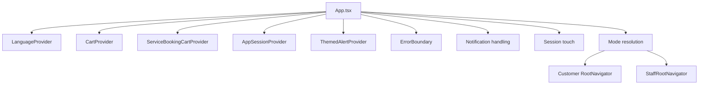

### 14.3 Global state ownership map

| State | Owner | Storage | Notes |
|---|---|---|---|
| Language | `LanguageContext` | AsyncStorage | Drives RTL and translations |
| Auth token | API client | SecureStore | Access/refresh token pair |
| Normalized user | API client + screens | AsyncStorage | Cached profile fallback |
| Session activity | API client | AsyncStorage | Used for keep-alive / expiry |
| Product cart | `CartContext` | AsyncStorage | Tenant-scoped |
| Service booking cart | `ServiceBookingCartContext` | AsyncStorage | Tenant-scoped, grouped bookings |
| App phase | `App.tsx` | React state | Splash/onboarding/auth/home |
| App mode | `App.tsx` | React state | Customer vs staff |
| Push token | `lib/notifications.ts` | AsyncStorage + backend | Registered only when authenticated |

### 14.4 Global failure matrix

| Failure | Observable symptom | Likely origin |
|---|---|---|
| Font load fails | Splash may render but app style can degrade | `App.tsx` font bootstrap |
| Session expired | App returns to auth / login loop | SecureStore token + refresh flow |
| Language reload fails | RTL/LTR not applied correctly | `LanguageContext` + `expo-updates` |
| Push registration fails | No notification badge / missing device token | `lib/notifications.ts` + `registerPushToken` |
| App mode misdetected | Wrong navigator shown | `api.getStaffProfile()` branch |

### 14.5 Global performance analysis

Strengths:

- splash is simple
- navigation is split cleanly by root
- most list sections are lazy-loaded on focus or mount

Risks:

- several large screens fetch many endpoints serially
- some screens keep local fallback state and async rehydration state simultaneously
- app mode resolution adds one extra authenticated backend call during startup

### 14.6 Global security analysis

Strengths:

- access and refresh tokens are in SecureStore rather than plain AsyncStorage
- authenticated actions are guarded by `ensureAuthenticated`
- push token registration is tied to authenticated sessions

Risks:

- local cached user data exists in AsyncStorage and must be treated as non-authoritative
- deep links can route into sensitive flows, so backend authorization remains essential

### 14.7 Global technical debt

- customer and staff runtime live in the same binary
- the app still contains legacy/non-canonical screens (`DashboardScreen`, `BookingFlow`)
- data normalization is mixed across UI and API client in some places
- several screens duplicate “resolve image” logic instead of relying exclusively on `getImageUrl`

### 14.8 Global production-readiness assessment

Overall, the app is production-oriented and already wired to canonical backend endpoints for:

- auth
- profile
- booking
- notifications
- orders
- payments
- discovery

The main production risks are not missing shells, but rather:

- duplicated fallback logic
- overly large feature screens
- legacy navigation remnants
- inconsistent use of canonical helpers in a few screens

---

## 15. Authentication and Session Investigation

### 15.1 Runtime execution timeline

1. `App.tsx` loads app shell
2. `App.tsx` checks onboarding completion and saved language
3. `AuthNavigator` or `RootNavigator` is selected
4. login/register/google/forgot/reset screens call API client methods
5. tokens are stored in SecureStore
6. user is cached locally
7. session is touched
8. app mode is resolved
9. push registration is attempted

### 15.2 Function call graph

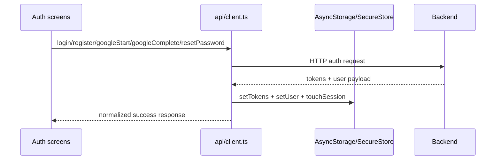

### 15.3 State ownership map

| State | Owner | Source | Scope |
|---|---|---|---|
| Authentication status | `AppSessionContext` + API client | token storage | App shell and protected screens |
| User profile | API client cache + backend profile | `/users/profile` | UI display only |
| Google onboarding state | Google onboarding screen | AsyncStorage | Temporary onboarding only |
| Password reset token | `App.tsx` deep link parser | URL / route state | Auth recovery only |

### 15.4 Failure matrix

| Failure | Symptom | Root cause class |
|---|---|---|
| Token refresh fails | silent logout or session reset | SecureStore / refresh-token mismatch |
| Google onboarding interrupted | user must repeat onboarding | multi-step auth chain across UI + backend |
| Password reset token absent | reset screen cannot proceed | deep-link parsing / navigation input |
| profile cache stale | stale avatar or name in UI | AsyncStorage cache vs backend authoritative profile |

### 15.5 Security analysis

- refresh tokens are handled carefully and can recover sessions
- the app deliberately avoids exposing backend auth internals in the UI
- Google onboarding uses an id-token exchange rather than trusting client-side identity alone

### 15.6 Technical debt

- login/register/google onboarding are split across multiple screens and token states
- user profile may be loaded from `getProfile()` or fall back to cached `getUser()`
- some screens still treat cached profile as a cosmetic fallback

### 15.7 Production readiness assessment

Authentication is structurally production-ready.

The primary risk is not capability, but keeping token/session cache and server state aligned.

---

## 16. Discovery, Home, and Tenant Browsing Investigation

### 16.1 Runtime execution timeline

1. `HomeScreen` mounts
2. `HomeHeader` loads profile and unread notification count
3. home sections load hot deals, new salons, categories, trending salons, top providers
4. `BrowseScreen` loads public tenants and categories
5. `TenantScreen` loads tenant details, page-data, services, products, staff, gifts, reviews

### 16.2 Function call graph

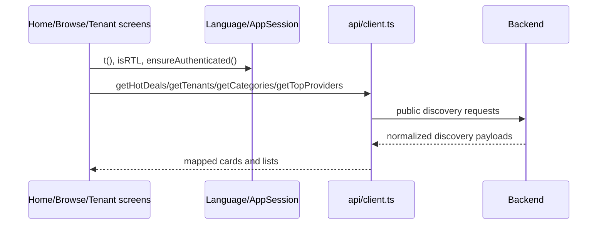

### 16.3 State ownership map

| State | Owner | Source |
|---|---|---|
| home section lists | each home component | API responses |
| tenant detail state | `TenantScreen` | API responses + route params |
| product search query | `TenantScreen` | React state |
| active tab | `TenantScreen` | React state |
| reviews summary | `TenantScreen` | API response |

### 16.4 Dependency graph

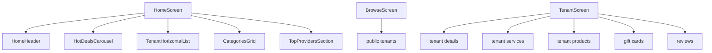

### 16.5 Failure matrix

| Failure | Symptom | Likely origin |
|---|---|---|
| `getHotDeals()` fails | home carousel empty / retry state | network or backend discovery endpoint |
| `getTenants()` fails | browse page empty | public tenant API |
| `getCustomerAppContent()` fails | help/about/privacy sections empty | customer app content endpoint + cached fallback |
| tenant page `page-data` missing | tabs collapse to defaults | tenant page-data contract |
| product search fails | tenant products tab shows stale or empty search results | product endpoint or search debounce state |

### 16.6 Performance analysis

The discovery surface is mostly composed of horizontally scrolling lists and small cards.

This is generally good for perceived performance.

The main cost is `TenantScreen`, which can fan out into multiple requests:

- tenant detail
- page data
- services
- products
- staff
- gift cards
- reviews

### 16.7 Security analysis

The public discovery APIs are intentionally public.

The app still correctly distinguishes:

- public discovery data
- authenticated account data

### 16.8 Technical debt

- `TenantScreen` is large and aggregates too many concerns
- product search state is local to the tenant screen
- service/product/gifts/reviews are mixed into one dense tenant page
- some fallback logic is embedded directly in the screen rather than in a dedicated coordinator

### 16.9 Root-cause investigation: architectural weakness

`TenantScreen` is powerful, but it is also the clearest example of a “god screen.”

That makes it hard to debug because:

- tabs
- search
- page-data
- display flags
- services
- products
- gifts
- reviews

all coexist in a single runtime surface.

This is not a bug by itself, but it is a future maintenance risk.

### 16.10 Production readiness assessment

Discovery and tenant browsing are production-ready in function.

Their risk is complexity, not missing capability.

---

## 17. Booking and Scheduling Investigation

### 17.1 Canonical runtime timeline

The active booking journey in the repository is `BookingJourneyScreen`, supported by `ServiceDetailsScreen` and `ServiceBookingCartScreen`.

Booking runtime:

1. open service or booking journey
2. choose staff
3. choose date
4. choose time
5. review booking
6. optionally add guests/participants
7. submit booking
8. navigate to payment or confirmation

### 17.2 Function call graph

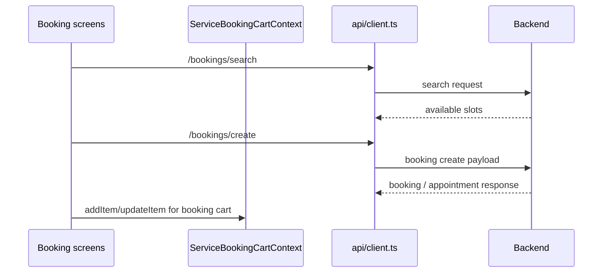

### 17.3 State ownership map

| State | Owner | Source |
|---|---|---|
| selected staff | booking screen state | route params / user selection |
| selected date | booking screen state | React state |
| selected time | booking screen state | slot search result |
| slot availability | booking screen state | `/bookings/search` |
| guest participants | `BookingJourneyScreen` | React state |
| booking cart | `ServiceBookingCartContext` | AsyncStorage |
| payment settings | tenant data / route params | backend tenant payload |

### 17.4 Dependency graph

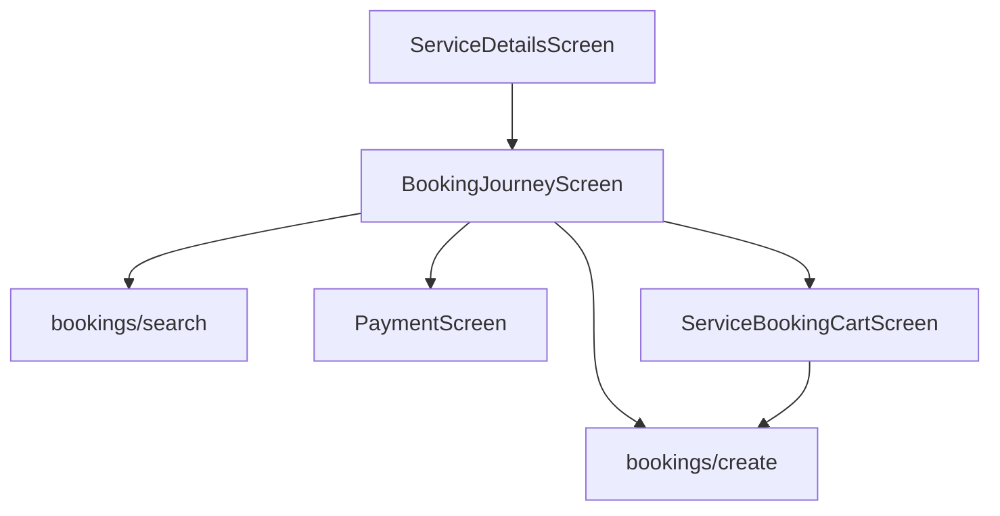

### 17.5 Booking mode state diagram

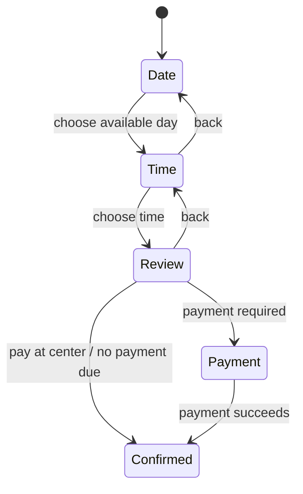

### 17.6 Failure matrix

| Failure | Symptom | Root cause class |
|---|---|---|
| no available slots | booking cannot proceed | backend search availability or staff/service mismatch |
| payment settings missing | wrong payment options visible | tenant paymentSettings payload |
| selected staff missing | booking screen falls back to “any specialist” | route payload / staff lookup issue |
| duplicate booking journey code paths | hard-to-debug booking behavior | `BookingJourneyScreen` vs `BookingFlow.tsx` |

### 17.7 Performance analysis

`BookingJourneyScreen` is one of the heavier runtime surfaces because it may:

- query availability for multiple dates
- query time slots
- maintain multiple participants
- compute deposit/payment summaries

The performance risk is the number of sequential availability calls.

### 17.8 Security analysis

- booking operations require authenticated session for final submission
- the UI uses `ensureAuthenticated()` before confirming booking
- guest participant data is user-entered and should be treated as untrusted input until persisted

### 17.9 Technical debt

- there are two booking-related screens in the repo (`BookingJourneyScreen` and `BookingFlow`)
- the active route uses `BookingJourneyScreen`, leaving `BookingFlow` as an orphaned legacy implementation
- booking and payment summary logic is repeated across review and payment surfaces

### 17.10 Root-cause investigation: architectural weakness

The repository contains two different booking experiences:

- one canonical route-backed journey
- one orphaned legacy screen

This is a classic source of “looks similar, behaves differently” defects.

### 17.11 Production readiness assessment

The active booking journey is production-oriented.

The main engineering risk is route duplication and large component size.

---

## 18. Appointment History, Review, and Invite Investigation

### 18.1 Runtime execution timeline

1. `BookingsScreen` loads booking history
2. booking groups are assembled by booking reference/session
3. appointment details load specific booking
4. reviews are fetched for eligible completed bookings
5. invites are loaded by token and responded to

### 18.2 Function call graph

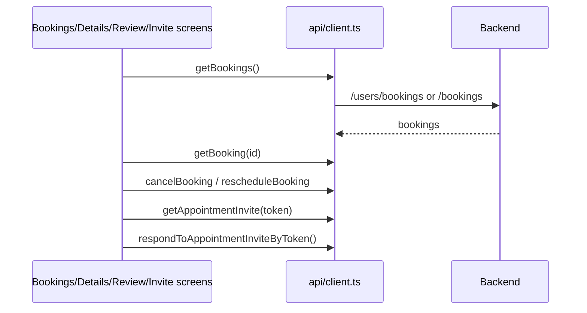

### 18.3 State ownership map

| State | Owner | Source |
|---|---|---|
| booking list | `BookingsScreen` | API |
| review list | `BookingsScreen` / `ReviewScreen` | API |
| invite detail | `AppointmentInviteScreen` | API |
| appointment detail | `AppointmentDetailsScreen` | API |

### 18.4 Failure matrix

| Failure | Symptom | Likely origin |
|---|---|---|
| no bookings loaded | empty appointments tab | bookings endpoint or auth/session issue |
| cancel/reschedule blocked | actions unavailable | backend status rules |
| invite token invalid | invite screen cannot resolve booking | token / deep-link mismatch |
| review duplication | user sees duplicate review state | review eligibility / local cache mismatch |

### 18.5 Performance analysis

The bookings tab is reasonably lightweight but can grow with:

- long history
- multiple review lookups
- invite / detail navigation

### 18.6 Security analysis

- appointment detail and review flows must remain tenant/user scoped
- invite tokens are treated as special deep-link credentials and must still be verified server-side

### 18.7 Technical debt

- booking history grouping is done on the client as a convenience layer
- appointment timeline/audit markers are parsed from notes-like content in the screen
- multiple UX surfaces can reach booking detail, increasing state-sharing complexity

### 18.8 Production readiness assessment

Appointments history, review, and invite handling are production-ready, but the flows are highly dependent on stable backend contracts.

---

## 19. Commerce: Products, Cart, Orders, and Payments Investigation

### 19.1 Runtime execution timeline

1. product discovered in tenant page or product detail
2. product added to cart
3. cart is persisted locally
4. cart screen hydrates user defaults
5. order payload is submitted
6. payment is optionally performed
7. purchase history updates through orders API

### 19.2 Function call graph

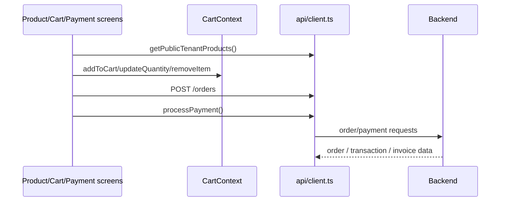

### 19.3 State ownership map

| State | Owner | Source |
|---|---|---|
| product cart items | `CartContext` | AsyncStorage |
| cart tenant id | `CartContext` | first cart item |
| checkout contact details | `CartScreen` | profile defaults + local state |
| payment method | `PaymentScreen` | local state |
| eligible payment sources | `PaymentScreen` | API |
| order history | `PurchasesScreen` | API |
| wallet balance | `PaymentScreen` / wallet screens | API |

### 19.4 Dependency graph

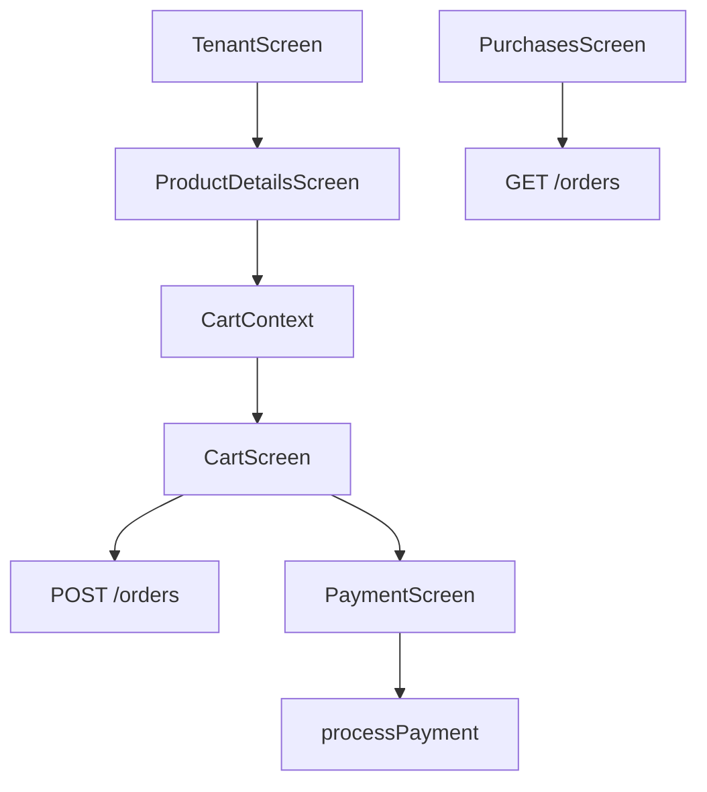

### 19.5 Failure matrix

| Failure | Symptom | Root cause class |
|---|---|---|
| product image missing | broken product card image | product image payload or normalization |
| cart mixed tenant items | add-to-cart rejected | deliberate cross-tenant guard |
| order submission fails | checkout cannot complete | order contract / backend validation |
| payment source unavailable | payment screen cannot proceed | `/payments/sources` contract |
| payment success mismatch | UI says success but history missing | payment/order/invoice producer divergence |

### 19.6 Performance analysis

Good:

- product cart is local and fast
- product detail is isolated

Risks:

- product lists can be large and may need server-side search/filtering
- payment screen may request multiple pieces of data before rendering

### 19.7 Security analysis

- order and payment operations depend on authentication
- profile data used in checkout is only a convenience prefill
- the cart is local state and must not be treated as trusted purchase proof until backend confirms

### 19.8 Technical debt

- order/payment/payment-success logic spans multiple screens
- cart state and checkout state are separated, which is good, but can be hard to trace without the API client as the canonical source
- product search currently lives in tenant/product views, not as a dedicated centralized catalog engine

### 19.9 Root-cause investigation: architectural weakness

The customer commerce stack is split into:

- product discovery
- local cart
- order creation
- payment
- purchase history

This is structurally correct, but the cross-screen handoff makes it important that DTOs stay canonical.

### 19.10 Production readiness assessment

Commerce is production-oriented and substantially wired.

The highest risk is contract drift between cart/order/payment/notifications rather than missing UI shell.

---

## 20. Gifts and Wallet Investigation

### 20.1 Runtime execution timeline

1. gifts screen loads packages or wallet data
2. user chooses self/send mode
3. user selects package or balance action
4. claim / recharge / send flows execute
5. history and wallet summary update

### 20.2 Function call graph

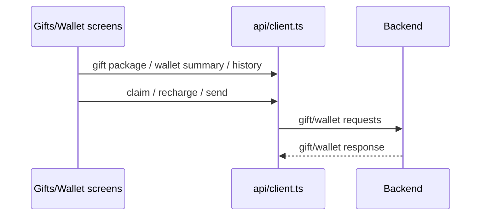

### 20.3 State ownership map

| State | Owner | Source |
|---|---|---|
| gift package list | `GiftsScreen` | API |
| wallet summary | `GiftsScreen` / wallet screens | API |
| gift history | `GiftsScreen` | API |
| claim/send modal state | `GiftsScreen` | React state |

### 20.4 Failure matrix

| Failure | Symptom | Likely origin |
|---|---|---|
| no gift packages | gifts tab empty | public gift-card endpoint or tenant configuration |
| claim fails | gift cannot be redeemed | token / account mismatch |
| wallet summary missing | balances show zero/empty | wallet endpoint |

### 20.5 Performance analysis

This surface is moderate in cost but can become heavy if histories are long or if multiple wallet summaries are fetched.

### 20.6 Security analysis

- gift claim and send flows should remain authenticated and server-validated
- gift / wallet tokens in deep links must be treated as sensitive

### 20.7 Technical debt

- the gifts screen multiplexes many sub-flows in one file
- similar financial concepts appear in multiple places (gifts, wallet, orders, payment), so contract discipline matters

### 20.8 Production readiness assessment

The gifts and wallet surface is usable and materially implemented, but its breadth makes it vulnerable to contract drift.

---

## 21. Notifications Investigation

### 21.1 Runtime execution timeline

1. app initializes notification handling
2. push token is registered if authenticated
3. notification listeners route taps to screens
4. notification list screen fetches inbox
5. read state is updated immediately when opened

### 21.2 Function call graph

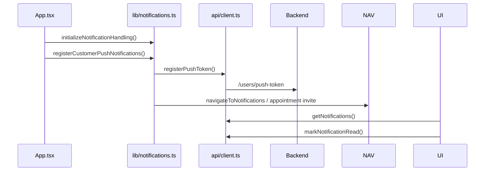

### 21.3 State ownership map

| State | Owner | Source |
|---|---|---|
| push token | `lib/notifications.ts` | AsyncStorage + backend |
| notification badge count | `HomeHeader`, `MoreScreen`, `NotificationsScreen` | API |
| pending notification deep-link payload | `lib/notifications.ts` | AsyncStorage |

### 21.4 Dependency graph

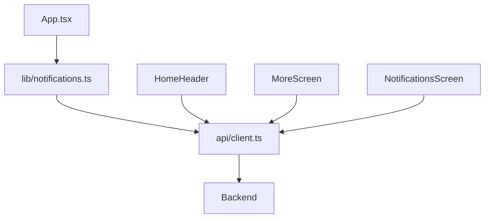

### 21.5 Failure matrix

| Failure | Symptom | Likely origin |
|---|---|---|
| push token not stored | notifications not delivered | registration flow / permissions |
| unread count wrong | badge mismatch | notification summary endpoint |
| deep link tap not routed | push tap opens wrong screen | notification handling bridge |
| read state not updated | inbox shows stale unread count | `markNotificationRead` or list refresh |

### 21.6 Performance analysis

- unread count fetch is light
- badge refresh happens on focus and push receipt
- notification list uses pagination-ish page/limit inputs

### 21.7 Security analysis

- notification tokens are device credentials and must be backend-managed
- deep links can route to sensitive resources, so backend authorization remains mandatory

### 21.8 Technical debt

- notification state is duplicated in badges, inbox, and deep-link storage
- notification-driven routing is split between `lib/notifications.ts` and `navigationService.ts`

### 21.9 Root-cause investigation: architectural weakness

The notification system is intentionally lightweight but there are two parallel concerns:

- device registration / push token management
- notification inbox and navigation

That split is fine, but it requires the API client to remain the single source of truth for payload shapes.

### 21.10 Production readiness assessment

Notifications are production-oriented and functionally complete for the customer app’s current scope.

---

## 22. Profile and Settings Investigation

### 22.1 Runtime execution timeline

1. profile screen loads current profile
2. avatar upload may update the profile
3. settings screen loads profile preferences
4. language / push toggle / delete account actions mutate user state
5. logout clears session and returns to auth

### 22.2 Function call graph

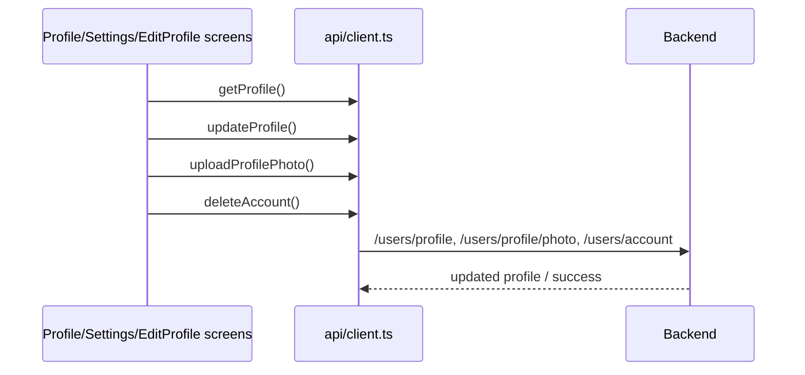

### 22.3 State ownership map

| State | Owner | Source |
|---|---|---|
| editable profile fields | `EditProfileScreen` | React state + backend profile |
| avatar image | `ProfileScreen` / `UserAvatar` | backend profileImage |
| language setting | `LanguageContext` | AsyncStorage |
| push preference | `SettingsScreen` | backend profile notificationPreferences |
| delete confirmation state | `SettingsScreen` | React state |

### 22.4 Dependency graph

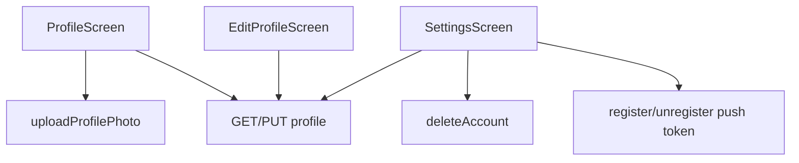

### 22.5 Failure matrix

| Failure | Symptom | Likely origin |
|---|---|---|
| avatar upload fails | avatar remains placeholder | upload endpoint or image URL normalization |
| profile fetch fails | fallback cache used | profile endpoint or auth |
| push toggle fails | toggle reverts | profile preferences update or push-token registration |
| delete account fails | account remains active | backend delete strategy / password requirement |

### 22.6 Performance analysis

Profile/settings screens are lightweight, with the main cost being a backend fetch on focus.

### 22.7 Security analysis

- delete account is password-gated when auth provider is local
- push toggles are coupled to authenticated profile mutation
- profile caching must not be treated as authoritative

### 22.8 Technical debt

- profile data is sometimes read from cache and sometimes from backend
- settings is currently a small page with only a limited number of user controls
- profile/avatar helpers are shared, but specific screens still do some local fallback handling

### 22.9 Root-cause investigation: architectural weakness

`SettingsScreen` is correct for its scope, but the full user preference model is only partially surfaced in the current app.

### 22.10 Production readiness assessment

Profile and settings are production-ready for the implemented controls.

---

## 23. Helper and Shared Component Investigation

### 23.1 `UserAvatar`

`UserAvatar` is the canonical avatar renderer in the shared UI components.

It:

- builds initials when no image is available
- resolves image URLs through `getImageUrl()`
- falls back to initials if the image fails

### 23.2 `AppIcon`

`AppIcon` is the canonical icon abstraction.

It maps semantic icon names to SVG assets and is used throughout the app.

### 23.3 `GuestView`

This is the guest-state component used when the user is not authenticated.

### 23.4 `ReviewPromptModal`

This is a specialized review CTA modal tied to appointment completion.

### 23.5 Shared utility risk matrix

| Helper | Importance | Failure impact |
|---|---|---|
| `getImageUrl` | critical | broken avatars/images across app |
| `formatRiyal` | high | pricing presentation inconsistency |
| `buildGroupGuestPayload` | high | booking participant payload mismatch |
| `useScreenSafeArea` | medium | layout / keyboard / footer positioning bugs |

---

## 24. Architectural Weakness Root-Cause Register

These are not necessarily current bugs, but they are the most likely future root causes if a regression appears.

### 24.1 Legacy duplicate booking surface

Root cause:

- `BookingJourneyScreen` is the active route
- `BookingFlow.tsx` still exists as a large alternate booking implementation

Why it matters:

- future engineers may patch the wrong screen
- booking logic can diverge over time

### 24.2 Large tenant page

Root cause:

- `TenantScreen` aggregates services, products, gifts, reviews, and about content

Why it matters:

- UI state and data loading are tightly coupled
- product search and tab logic can become difficult to reason about

### 24.3 Mixed source of truth for profile display

Root cause:

- screens sometimes use `getUser()` cache and sometimes `getProfile()`

Why it matters:

- stale avatar/name data can show even when backend profile has changed

### 24.4 Duplicated image fallback logic

Root cause:

- canonical URL helper exists (`getImageUrl`)
- some screens still build image candidates manually before resolving them

Why it matters:

- inconsistent image rendering rules
- harder to trace broken images

### 24.5 Notification routing split across modules

Root cause:

- push-token management and navigation routing are separated

Why it matters:

- deep-link bugs can look like notification bugs or navigation bugs depending on the failure point

---

## 25. Cross-Subsystem Traceability Matrix

| Bug area | First place to inspect in the codebase | Why |
|---|---|---|
| login / session | `App.tsx`, `AppSessionContext`, `src/api/client.ts` | startup + token lifecycle |
| onboarding / language | `OnboardingNavigator`, `LanguageContext` | phase and RTL changes |
| discovery / home | `HomeScreen`, `HomeHeader`, home components | list aggregation |
| tenant page | `TenantScreen` | multi-domain tenant surface |
| booking | `BookingJourneyScreen`, `ServiceDetailsScreen`, `ServiceBookingCartScreen` | canonical booking flow |
| appointments | `BookingsScreen`, `AppointmentDetailsScreen` | history and mutations |
| orders / payments | `CartScreen`, `PurchasesScreen`, `PaymentScreen` | commerce lifecycle |
| gift / wallet | `GiftsScreen`, wallet screens | secondary commerce lifecycle |
| notifications | `lib/notifications.ts`, `NotificationsScreen`, `HomeHeader` | device + inbox + routing |
| profile | `ProfileScreen`, `EditProfileScreen` | user account data |
| settings | `SettingsScreen` | preferences, push, delete account |

---

## 26. Investigation-Ready Mermaid State Summary

### 26.1 App phase state diagram

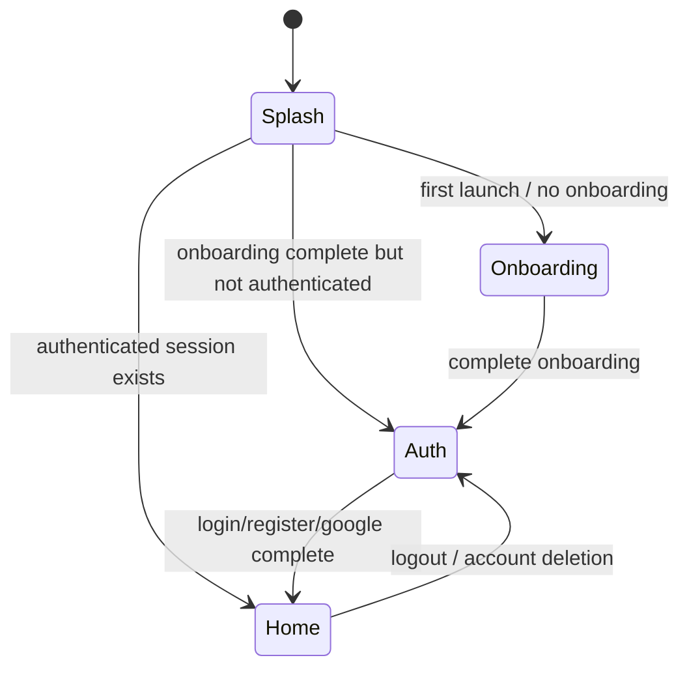

### 26.2 Customer app mode diagram

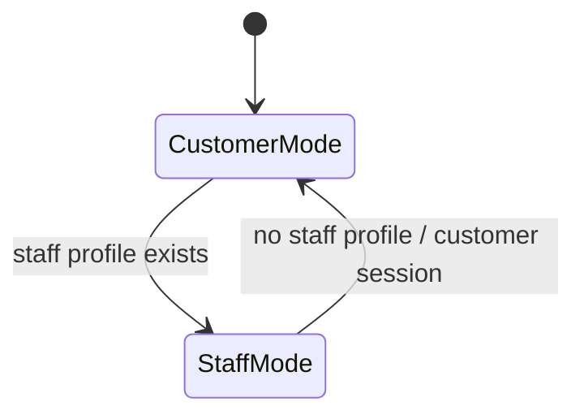

### 26.3 Booking lifecycle diagram

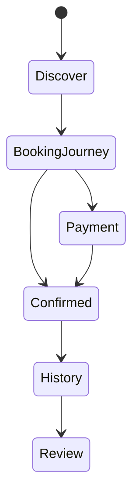

### 26.4 Commerce lifecycle diagram

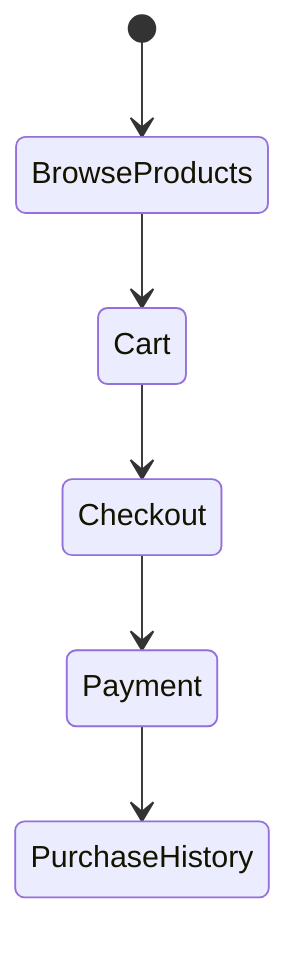

---

## 27. Final Investigation Assessment

From a reverse-engineering perspective, the customer app is already substantial and production-oriented.

The highest-value investigative anchors for future debugging are:

1. `App.tsx`
2. `src/api/client.ts`
3. `TenantScreen.tsx`
4. `BookingJourneyScreen.tsx`
5. `BookingsScreen.tsx`
6. `CartScreen.tsx`
7. `PaymentScreen.tsx`
8. `GiftsScreen.tsx`
9. `NotificationsScreen.tsx`
10. `SettingsScreen.tsx`

If a future bug appears in the customer app, the fastest path to root cause is usually:

UI screen
→ local state
→ context
→ API client
→ backend endpoint
→ storage / cached fallback

This document is now expanded to support that trace.

---

## 28. Authentication and Session Engineering Investigation

### 28.1 Scope

This chapter reverse-engineers the customer app authentication, session, Google onboarding, password reset, logout, and app-mode resolution pipelines.

It is based on the implementation currently present in:

- `RifahMobile/App.tsx`
- `RifahMobile/src/api/client.ts`
- `RifahMobile/src/contexts/AppSessionContext.tsx`
- `RifahMobile/src/navigation/AuthNavigator.tsx`
- `RifahMobile/src/screens/WelcomeScreen.tsx`
- `RifahMobile/src/screens/LoginScreen.tsx`
- `RifahMobile/src/screens/RegisterScreen.tsx`
- `RifahMobile/src/screens/GoogleOnboardingScreen.tsx`
- `RifahMobile/src/screens/ForgotPasswordScreen.tsx`
- `RifahMobile/src/screens/ResetPasswordScreen.tsx`
- `RifahMobile/src/contexts/LanguageContext.tsx`
- `RifahMobile/src/lib/notifications.ts`

The report intentionally stays in investigation mode only.

No recommendations are included in this chapter.

---

### 28.2 Runtime ownership model

| Concern | Canonical owner | Storage / transport | Notes |
|---|---|---|---|
| app bootstrap and phase selection | `RifahMobile/App.tsx` | React state | chooses splash / onboarding / auth / home |
| authenticated request transport | `RifahMobile/src/api/client.ts` | SecureStore + AsyncStorage | owns tokens, session heartbeat, refresh retry |
| auth navigation shell | `RifahMobile/src/navigation/AuthNavigator.tsx` | React Navigation | owns welcome/login/register/google/forgot/reset routes |
| app-session gatekeeping | `RifahMobile/src/contexts/AppSessionContext.tsx` | React context | navigation/auth helper only |
| Google onboarding state | `RifahMobile/src/screens/GoogleOnboardingScreen.tsx` | AsyncStorage | persists partial onboarding between steps |
| language / RTL direction | `RifahMobile/src/contexts/LanguageContext.tsx` | AsyncStorage + I18nManager + expo-updates reload | direction switch forces native reload |
| push-token registration | `RifahMobile/src/lib/notifications.ts` | AsyncStorage + backend | participates in authenticated startup / logout side effects |
| app mode resolution | `RifahMobile/App.tsx` + `api.getStaffProfile()` | backend profile lookup | staff profile presence decides customer vs staff shell |

---

### 28.3 Complete runtime execution timeline

#### 28.3.1 Cold start

1. `App.tsx` loads fonts.
2. `App.tsx` checks language and onboarding state.
3. If onboarding is incomplete, the app stays in the onboarding navigator.
4. If onboarding is complete, `api.hasActiveSession()` decides whether the app starts in auth or home.
5. If session is active, `resolveAppMode()` calls `api.getStaffProfile()` to decide whether to mount `StaffRootNavigator` or `RootNavigator`.
6. The home container mounts and notification handling is enabled.

Evidence:

- `RifahMobile/App.tsx:302-345`
- `RifahMobile/App.tsx:449-472`
- `RifahMobile/src/api/client.ts:1091-1117`
- `RifahMobile/src/api/client.ts:1411-1418`

#### 28.3.2 Email/password login

1. `LoginScreen` validates email and password locally.
2. It posts to `/auth/user/login`.
3. On success it stores tokens.
4. It stores the normalized user object.
5. It calls the auth success callback.
6. `App.tsx` marks the app authenticated, touches the session heartbeat, resolves the app mode, and transitions to home.

Evidence:

- `RifahMobile/src/screens/LoginScreen.tsx:46-94`
- `RifahMobile/src/api/client.ts:1032-1042`
- `RifahMobile/src/api/client.ts:1351-1369`
- `RifahMobile/App.tsx:359-364`

#### 28.3.3 Registration

1. `RegisterScreen` validates name, email, phone, password, and password confirmation.
2. It posts to `/auth/user/register`.
3. On success it stores tokens.
4. If optional DOB / gender were supplied, it patches the profile.
5. It stores the returned user object.
6. It triggers the same auth-success path as login.

Evidence:

- `RifahMobile/src/screens/RegisterScreen.tsx:74-155`
- `RifahMobile/App.tsx:366-370`

#### 28.3.4 Google onboarding / first-party sign-in

1. `AuthNavigator` routes Google sign-in to `GoogleOnboardingScreen`.
2. The screen creates an Expo Google ID-token request.
3. It auto-starts the Google prompt when the request becomes available.
4. The returned Google ID token is sent to `/auth/user/google/start`.
5. If onboarding is required, the screen persists partial state and continues with phone / OTP / name steps.
6. On completion, `/auth/user/google/complete` returns access and refresh tokens plus a user object.
7. Tokens and user are stored.
8. The app success callback transitions to home.

Evidence:

- `RifahMobile/src/navigation/AuthNavigator.tsx:46-74`
- `RifahMobile/src/screens/GoogleOnboardingScreen.tsx:131-250`
- `RifahMobile/src/screens/GoogleOnboardingScreen.tsx:252-329`

#### 28.3.5 Password recovery

1. `ForgotPasswordScreen` posts the email to `/auth/user/forgot-password`.
2. `ResetPasswordScreen` posts the token and new password to `/auth/user/reset-password/:token`.
3. The reset screen is only reachable when `App.tsx` extracts a reset token from a deep link and sets the auth initial route.

Evidence:

- `RifahMobile/src/screens/ForgotPasswordScreen.tsx:24-50`
- `RifahMobile/src/screens/ResetPasswordScreen.tsx:24-60`
- `RifahMobile/App.tsx:125-204`

#### 28.3.6 App foreground / resume

1. `App.tsx` listens for app state transitions.
2. When the app returns from background to active state, it rechecks session validity.
3. If the session is no longer active, the app returns to auth.
4. If the session is still valid, it touches the session heartbeat and refreshes push registration.

Evidence:

- `RifahMobile/App.tsx:268-296`

#### 28.3.7 Logout

1. `handleLogout` unregisters push notifications if possible.
2. It clears SecureStore tokens.
3. It clears user and heartbeat data.
4. It resets auth phase and mode state.

Evidence:

- `RifahMobile/App.tsx:373-380`
- `RifahMobile/src/lib/notifications.ts:246-260`

---

### 28.4 Complete function call graph

#### 28.4.1 Login

```text
LoginScreen.handleLogin
  -> api.post('/auth/user/login')
  -> api.setTokens(accessToken, refreshToken)
  -> api.setUser(user)
  -> onLoginSuccess
     -> App.handleLoginSuccess
        -> api.touchSession()
        -> resolveAppMode()
           -> api.getStaffProfile()
        -> setIsAuthenticated(true)
        -> setAppPhase('home')
```

#### 28.4.2 Register

```text
RegisterScreen.handleRegister
  -> api.post('/auth/user/register')
  -> api.setTokens(accessToken, refreshToken)
  -> api.updateProfile(optional dob/gender)
  -> api.setUser(user)
  -> onRegisterSuccess
     -> App.handleRegisterSuccess
        -> api.touchSession()
        -> resolveAppMode()
           -> api.getStaffProfile()
        -> setIsAuthenticated(true)
        -> setAppPhase('home')
```

#### 28.4.3 Google onboarding

```text
GoogleOnboardingScreen.beginGoogleFlow
  -> promptAsync()
  -> GoogleOnboardingScreen.completeGoogleStart
     -> api.googleStart(idToken)
     -> api.setTokens(...)   [if no onboarding required]
     -> api.setUser(...)
     -> onSuccess()

GoogleOnboardingScreen.sendOtp
  -> api.googleSendPhoneOtp(onboardingToken, phone)

GoogleOnboardingScreen.completeFlow
  -> api.googleComplete(...)
  -> api.setTokens(accessToken, refreshToken)
  -> api.setUser(user)
  -> onSuccess()
```

#### 28.4.4 Refresh / session restore

```text
App.handleSplashFinish
  -> api.hasActiveSession()
     -> getToken()
     -> getRefreshToken()
     -> isSessionExpired()
     -> refreshAccessToken() when needed
        -> fetch /auth/user/refresh-token
        -> clearTokens() on 401/403 or expired response
        -> setTokens() on success
  -> if authenticated
     -> resolveAppMode()
        -> api.getStaffProfile()
```

#### 28.4.5 Logout

```text
App.handleLogout
  -> unregisterCustomerPushNotifications()
     -> api.unregisterPushToken()
  -> api.clearTokens()
  -> reset app phase and mode
```

---

### 28.5 State ownership map

| State | Owner | Persistence | What reads it |
|---|---|---|---|
| `appPhase` | `App.tsx` | React state | top-level renderer |
| `authInitialRoute` | `App.tsx` | React state | `AuthNavigator` key and route selection |
| `isAuthenticated` | `App.tsx` | React state | `AppSessionContext`, app shell, notification registration |
| `appMode` | `App.tsx` | React state | chooses `StaffRootNavigator` vs `RootNavigator` |
| `staffProfile` | `App.tsx` | React state | staff shell rendering |
| `pendingDeepLink` | `App.tsx` | React state | deferred navigation after auth/home readiness |
| `passwordResetToken` | `App.tsx` | React state | reset-password screen bootstrap |
| access token | `src/api/client.ts` | SecureStore | authenticated transport |
| refresh token | `src/api/client.ts` | SecureStore | silent recovery and 401 retry |
| user profile | `src/api/client.ts` | AsyncStorage | app identity, local render state |
| session heartbeat | `src/api/client.ts` | AsyncStorage | 90-day inactivity expiry |
| Google onboarding state | `GoogleOnboardingScreen.tsx` | AsyncStorage | survives partial onboarding |
| push token / debug | `src/lib/notifications.ts` | AsyncStorage | notification registration and diagnostics |
| language / RTL | `LanguageContext.tsx` | AsyncStorage + I18nManager | layout direction and translations |

---

### 28.6 Storage and token lifecycle

#### 28.6.1 SecureStore

Used for:

- access token
- refresh token

Evidence:

- `RifahMobile/src/api/client.ts:1032-1038`
- `RifahMobile/src/api/client.ts:1048-1056`
- `RifahMobile/src/api/client.ts:1123-1149`

#### 28.6.2 AsyncStorage

Used for:

- normalized user
- session heartbeat timestamp
- Google onboarding continuation state
- push token and push debug state
- pending notification deep-link payloads

Evidence:

- `RifahMobile/src/api/client.ts:1052-1053`
- `RifahMobile/src/api/client.ts:1059-1064`
- `RifahMobile/src/lib/notifications.ts:8-11`
- `RifahMobile/src/lib/notifications.ts:74-91`
- `RifahMobile/src/screens/GoogleOnboardingScreen.tsx:110-129`

#### 28.6.3 Session freshness policy

The client applies a 90-day inactivity window:

- `isSessionExpired()` reads `refah_session_last_active`
- if the timestamp is older than the window, tokens are cleared and the session becomes invalid

Evidence:

- `RifahMobile/src/api/client.ts:1082-1089`
- `RifahMobile/src/api/client.ts:1095-1099`

---

### 28.7 Deep-link and auth boundary behavior

The app can receive deep links for:

- booking invite
- order / purchase
- gift claim
- wallet
- notification
- review
- profile
- password reset

The router stores these intents first and only flushes them after the app is authenticated and the navigation container is ready.

Evidence:

- `RifahMobile/App.tsx:66-104`
- `RifahMobile/App.tsx:196-240`
- `RifahMobile/App.tsx:298-300`
- `RifahMobile/App.tsx:449-468`

This design prevents a large class of “link arrived before navigation mounted” bugs, but it also means auth state and navigation readiness are tightly coupled.

---

### 28.8 Failure matrix

| Scenario | Where it first manifests | What the code does | Resulting user-visible behavior |
|---|---|---|---|
| SecureStore write fails during token save | `api.setTokens()` | logs error and swallows it | user can be sent to home without durable session persistence |
| user write fails after login/register | `api.setUser()` | logs error and swallows it | UI may continue but local profile cache is missing |
| access token missing but refresh token exists | `hasActiveSession()` | calls `refreshAccessToken()` | silent recovery attempt |
| refresh call fails due transient network/runtime error | `refreshAccessToken()` | keeps stored tokens, returns `null` | session may remain logically active while request layer still needs a future retry |
| refresh call gets 401/403 | `refreshAccessToken()` | clears tokens | next auth check drops user to login |
| backend says token is expired in message payload | `refreshAccessToken()` | clears tokens | user is logged out |
| app resumes from background with invalid session | `App.tsx` AppState effect | switches to auth | home is abandoned on foreground |
| staff profile lookup fails | `resolveAppMode()` | falls back to customer mode | staff session can be misclassified as customer shell |
| Google onboarding partial state survives restart | `GoogleOnboardingScreen` AsyncStorage step state | resumes or restarts based on stored state | user may return mid-flow instead of full restart |
| notification registration fails while authenticated | `registerCustomerPushNotifications()` | warns but does not block login | session continues without push |
| logout fails to unregister push token | `handleLogout()` + notifications helper | still clears local auth state | device may retain server push token until next cleanup |

---

### 28.9 Root-cause register

#### 28.9.1 Silent token persistence failure

**Evidence**

- `RifahMobile/src/api/client.ts:1032-1042`
- `RifahMobile/src/api/client.ts:1364-1369`

**Why it matters**

Both token storage and user storage catch errors, log them, and do not propagate failure to the caller.

This means the login/register/google success path can continue even when durable session state was not actually written.

That is a real source of “I was logged in but the app did not remember me later” style failures.

#### 28.9.2 Session validity is inferred from multiple independent signals

**Evidence**

- `RifahMobile/src/api/client.ts:1091-1117`
- `RifahMobile/src/api/client.ts:1123-1162`

**Why it matters**

The app combines:

- access token presence
- refresh token presence
- inactivity timeout
- refresh success
- response status from the refresh endpoint

into a single boolean result.

The code is robust, but the state machine is distributed across several branches, so failures can present as subtle recoveries or delayed logouts instead of a single obvious authentication error.

#### 28.9.3 App mode is a secondary asynchronous decision

**Evidence**

- `RifahMobile/App.tsx:308-313`
- `RifahMobile/App.tsx:334-343`
- `RifahMobile/App.tsx:359-370`

**Why it matters**

The home shell is not only “authenticated vs unauthenticated”.

It also depends on whether `api.getStaffProfile()` succeeds.

That introduces a second decision layer after login, register, session restoration, and app resume.

If the staff profile request fails or is slow, the shell can fall back to customer mode even though the authenticated user is a staff member.

#### 28.9.4 Google onboarding uses persisted partial state plus an auto-start flow

**Evidence**

- `RifahMobile/src/screens/GoogleOnboardingScreen.tsx:110-129`
- `RifahMobile/src/screens/GoogleOnboardingScreen.tsx:152-250`
- `RifahMobile/src/screens/GoogleOnboardingScreen.tsx:252-329`

**Why it matters**

Google onboarding is not a single submit button.

It is a staged state machine with:

- auto-start
- ID token exchange
- phone step
- OTP step
- optional name step
- completion

The flow is carefully guarded, but it is also one of the highest-risk places for “first click vs second click” style behaviors because it depends on asynchronous prompt availability and persisted intermediate state.

---

### 28.10 Dependency graph

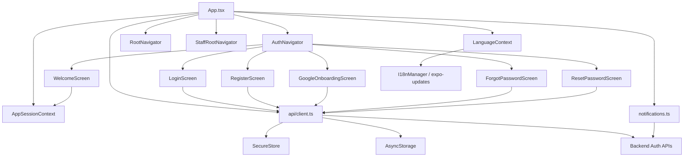

---

### 28.11 Mermaid sequence diagrams

#### 28.11.1 Startup and restore

```mermaid
sequenceDiagram
    participant App
    participant Lang as LanguageContext
    participant Store as SecureStore/AsyncStorage
    participant API as api/client.ts
    participant Nav as Navigator

    App->>Lang: loadLanguage()
    App->>Store: read onboarding + language + session heartbeat
    App->>API: hasActiveSession()
    API->>Store: read access token
    API->>Store: read refresh token
    API->>Store: read last active
    alt session valid
        API-->>App: true
        App->>API: getStaffProfile()
        App->>Nav: render staff/customer shell
    else session invalid
        API-->>App: false
        App->>Nav: render AuthNavigator
    end
```

#### 28.11.2 Email/password login

```mermaid
sequenceDiagram
    participant UI as LoginScreen
    participant API as api/client.ts
    participant Store as SecureStore/AsyncStorage
    participant App as App.tsx
    participant Backend as /auth/user/login

    UI->>Backend: POST credentials
    Backend-->>UI: accessToken + refreshToken + user
    UI->>API: setTokens()
    API->>Store: write access token
    API->>Store: write refresh token
    API->>Store: write heartbeat
    UI->>API: setUser()
    API->>Store: write user cache
    UI->>App: onLoginSuccess()
    App->>API: touchSession()
    App->>API: getStaffProfile()
    App-->>UI: home shell
```

#### 28.11.3 Google onboarding

```mermaid
sequenceDiagram
    participant UI as GoogleOnboardingScreen
    participant Google as Google SDK
    participant API as api/client.ts
    participant Store as AsyncStorage/SecureStore
    participant Backend as /auth/user/google/*

    UI->>Google: promptAsync()
    Google-->>UI: id token
    UI->>Backend: google/start
    Backend-->>UI: onboardingToken or direct session
    alt onboarding required
        UI->>Store: persist onboarding step
        UI->>Backend: send-phone-otp
        UI->>Backend: complete
    else direct session
        UI->>API: setTokens()
        UI->>API: setUser()
    end
```

#### 28.11.4 Logout

```mermaid
sequenceDiagram
    participant App as App.tsx
    participant Push as notifications.ts
    participant API as api/client.ts
    participant Store as SecureStore/AsyncStorage

    App->>Push: unregisterCustomerPushNotifications()
    Push->>API: unregisterPushToken()
    App->>API: clearTokens()
    API->>Store: delete access token
    API->>Store: delete refresh token
    API->>Store: delete user cache
    API->>Store: delete heartbeat
```

---

### 28.12 Production readiness assessment

#### Strengths

- Canonical API client centralizes token handling and endpoint normalization.
- App startup clearly separates onboarding, auth, and home.
- Session refresh is automatic and transparent when possible.
- Google onboarding has persisted partial state, which protects against mid-flow termination.
- Logout is centralized and clears both auth state and push registration side effects.

#### Technical debt

- Token and user persistence errors are swallowed rather than escalated.
- App mode resolution is a second asynchronous classification step after authentication.
- Session validity is distributed across several signals instead of one single canonical state object.
- Google onboarding is a multi-step asynchronous flow with several conditional branches and persisted intermediate state.
- Notification registration and session restoration are coupled to auth state but live in separate modules.

#### Investigation priority ranking

1. `RifahMobile/src/api/client.ts`
2. `RifahMobile/App.tsx`
3. `RifahMobile/src/screens/GoogleOnboardingScreen.tsx`
4. `RifahMobile/src/screens/LoginScreen.tsx`
5. `RifahMobile/src/screens/RegisterScreen.tsx`
6. `RifahMobile/src/lib/notifications.ts`
7. `RifahMobile/src/contexts/LanguageContext.tsx`
8. `RifahMobile/src/navigation/AuthNavigator.tsx`

This chapter is intended to be the first stop for any future auth/session bug investigation in the customer app.

---

## 29. Booking and Payment Source-of-Truth Investigation

This chapter is the canonical forensic reading of the booking and payment architecture in the customer app and the supporting backend.

### 29.1 Definitive source of truth

The live booking architecture is not a single screen. It is a chain of cooperating runtime owners:

- `ServiceDetailsScreen` starts the journey from a service detail surface.
- `BookingJourneyScreen` owns the live date/time/review selection flow wired into navigation.
- `ServiceBookingCartScreen` owns grouped service-session checkout and the actual booking creation payload for multi-service sessions.
- `PaymentScreen` owns the payment UI, card/wallet validation, and transition to success.
- `PaymentSuccessScreen` owns the success summary and jump into history.
- `BookingsScreen` owns booking history grouping and list rendering.
- `AppointmentDetailsScreen` owns booking detail, reschedule, cancel, and add-service entry points.
- `api/client.ts` owns the canonical transport, booking normalization, payment normalization, and fallback behavior.
- `server/src/controllers/bookingController.js` and `server/src/services/bookingService.js` own the server-side booking creation lifecycle.
- `server/src/controllers/paymentController.js`, `server/src/services/paymentService.js`, `server/src/services/splitPaymentService.js`, and `server/src/services/appointmentPaymentService.js` own the payment lifecycle, but in different runtime branches.

The legacy `BookingFlow.tsx` file exists in the tree, but it is not mounted by the active customer navigation graph.

### 29.2 Runtime execution timeline

#### Active customer booking path

1. User opens a service in `ServiceDetailsScreen`.
2. `handleBook()` navigates to `Booking` with `service`, `tenant`, optional `selectedStaff`, optional `selectedVariant`, and optional booking session metadata.
3. `BookingJourneyScreen` receives the route payload, initializes selected date/time/participants, and starts availability lookups.
4. Availability is searched through `POST /api/v1/bookings/search`.
5. `BookingJourneyScreen` displays date/time/review state and guest participant editing.
6. In the current source snapshot, `handleContinue()` is still a placeholder alert saying the review/payment step will come in the next phase.
7. The live multi-service commit path is `ServiceBookingCartScreen`, which posts `POST /api/v1/bookings/create` with `items[]` and optional `bookingSessionId` / `bookingReference`.
8. The backend creates `BookingSession` and appointment rows, syncs totals, generates invoice records, and emits notifications.
9. If payment is due now, `ServiceBookingCartScreen` fetches eligible payment sources via `GET /api/v1/payments/sources`.
10. `ServiceBookingCartScreen` navigates to `PaymentScreen`.
11. `PaymentScreen` validates the selected method and posts `POST /api/v1/payments/process`.
12. The backend settles the payment, writes `Transaction` / `PaymentTransaction` / invoice state, and returns a payment result.
13. `PaymentSuccessScreen` renders confirmation and can navigate into `AppointmentDetailsScreen`.
14. `BookingsScreen` and `AppointmentDetailsScreen` rehydrate the booking into history and detail views via `/users/bookings` and `/bookings/:id`.

#### Adjacent product-order path

1. User opens `CartScreen`.
2. `CartContext` provides local cart state.
3. `CartScreen` posts `POST /api/v1/orders`.
4. If online payment is selected, `CartScreen` navigates to `PaymentScreen` with `orderId`.
5. `PaymentScreen` posts `POST /api/v1/payments/process`.
6. The backend settles the order payment and the purchase appears in purchases/history screens.

#### Public guest booking path

1. Public tenant booking routes exist in `publicTenantController.createPublicBooking`.
2. That path can create a booking without customer auth.
3. It still persists appointments and invoices and can create payment transactions for booking-fee or full-online modes.
4. The customer mobile app inspected here does not mount that public route directly in the active booking journey.

### 29.3 Full function call graph

```mermaid
sequenceDiagram
    participant UI as ServiceDetailsScreen / BookingJourneyScreen
    participant CART as ServiceBookingCartContext
    participant PAYUI as PaymentScreen
    participant H as api/client.ts
    participant BC as bookingController
    participant BS as bookingService
    participant PC as paymentController
    participant PS as paymentService
    participant SP as splitPaymentService
    participant HIS as BookingsScreen / AppointmentDetailsScreen

    UI->>H: POST /bookings/search
    H->>BC: searchAvailability
    BC->>BS: availabilityService.getAvailableSlots
    BS-->>BC: slots
    BC-->>H: slots response

    UI->>CART: add/update booking cart item(s)
    CART->>H: POST /bookings/create
    H->>BC: createBooking
    BC->>BS: createBooking / createBookingSession
    BS->>BS: createBooking (per item)
    BS->>BS: ensureAppointmentInvoice
    BS->>BS: notificationOrchestrator
    BC-->>H: bookingSession + appointments

    CART->>H: GET /payments/sources
    PAYUI->>H: POST /payments/process
    H->>PC: processPayment
    PC->>PS: processPayment / processWalletPayment
    PS->>SP: createAppointmentPaymentTransactions / recordRemainderPayment
    PS-->>PC: transaction / invoice
    PC-->>H: payment response

    HIS->>H: GET /users/bookings
    HIS->>H: GET /bookings/:id
```

### 29.4 State ownership map

| State | Owner | Storage / source |
|---|---|---|
| selected service | `ServiceDetailsScreen` | React route state |
| selected staff | `ServiceDetailsScreen` / `BookingJourneyScreen` | route params + React state |
| selected variant | `ServiceDetailsScreen` / `BookingJourneyScreen` | route params + React state |
| selected date | `BookingJourneyScreen` | React state |
| selected time | `BookingJourneyScreen` | React state |
| time availability | `BookingJourneyScreen` | `/bookings/search` |
| guest participants | `BookingJourneyScreen` | React state |
| booking cart items | `ServiceBookingCartContext` | AsyncStorage |
| booking session id/reference | `ServiceBookingCartContext` / backend `BookingSession` | AsyncStorage + DB |
| customer profile defaults | `CartScreen` / `PaymentScreen` / profile screens | `/users/profile` + local form state |
| payment method selection | `PaymentScreen` | React state |
| eligible payment sources | `PaymentScreen` | `/payments/sources` |
| order cart items | `CartContext` | AsyncStorage |
| booking history groups | `BookingsScreen` | API + client grouping |
| booking detail state | `AppointmentDetailsScreen` | API + React modal state |
| app auth/session | `App.tsx` / `AppSessionContext` | SecureStore + AsyncStorage |

### 29.5 Complete booking journey

1. Service is discovered on `TenantScreen` or `ServiceBrowserScreen`.
2. Service detail is opened on `ServiceDetailsScreen`.
3. Staff / variant can be selected before routing to `Booking`.
4. `BookingJourneyScreen` searches availability and lets the customer set date/time.
5. Guest / participant selection can be edited.
6. Review summarizes the service, date, time, staff, deposit/remainder, and participant breakdown.
7. The actual persisted multi-service booking path is the booking cart checkout screen.
8. Appointment rows are persisted.
9. Payment is initiated if due.
10. Payment completion routes to success.
11. Success routes into appointment detail or history.
12. History groups and displays the booking session as a single customer-visible record.

```mermaid
stateDiagram-v2
    [*] --> ServiceSelected
    ServiceSelected --> BookingJourney
    BookingJourney --> AvailabilityChecked
    AvailabilityChecked --> DateSelected
    DateSelected --> TimeSelected
    TimeSelected --> Review
    Review --> BookingCartCheckout: grouped services / session checkout
    BookingCartCheckout --> PaymentRequired: payable now > 0
    BookingCartCheckout --> Confirmed: payable now = 0
    PaymentRequired --> Paid: payment succeeds
    Paid --> Confirmed
    Confirmed --> History
    History --> AppointmentDetails
    AppointmentDetails --> Reschedule
    AppointmentDetails --> Cancel
    AppointmentDetails --> Review
```

### 29.6 Booking state machine

The booking journey itself has two overlapping state systems:

#### UI state

- service selected
- staff selected
- variant selected
- date selected
- time selected
- guest draft editing
- review opened
- checkout navigated

#### Persistence state

- session draft created
- appointment rows created
- invoice created
- payment pending or paid
- appointment confirmed
- booking history visible

```mermaid
stateDiagram-v2
    [*] --> Draft
    Draft --> SlotSearch
    SlotSearch --> SelectedDate
    SelectedDate --> SelectedTime
    SelectedTime --> Review
    Review --> SessionCreated
    SessionCreated --> AppointmentRowsCreated
    AppointmentRowsCreated --> AwaitingPayment
    AwaitingPayment --> Confirmed
    Confirmed --> HistoryVisible
```

### 29.7 Payment state machine

`paymentStatus` in appointments is normalized in `server/src/utils/appointmentPaymentStatus.js` and used throughout the customer app via `bookingNeedsPayment()` / `getBookingOutstandingAmount()`.

```mermaid
stateDiagram-v2
    [*] --> pending
    pending --> deposit_paid: booking-fee deposit collected
    pending --> fully_paid: full payment collected
    deposit_paid --> fully_paid: remainder collected
    fully_paid --> refunded: refund posted
    deposit_paid --> partially_refunded: partial refund posted
    fully_paid --> partially_refunded: partial refund posted
    refunded --> [*]
    partially_refunded --> [*]
```

Customer-facing payment UI state in `PaymentScreen` is separate:

- idle
- loading eligible sources
- selecting wallet/card
- validating card fields
- processing
- success
- failure

### 29.8 Booking API call graph

```mermaid
flowchart TD
    SD[ServiceDetailsScreen] --> BJ[BookingJourneyScreen]
    BJ --> S1[POST /bookings/search]
    S1 --> AV[availabilityService.getAvailableSlots]
    BJ --> CART[ServiceBookingCartScreen]
    CART --> C1[POST /bookings/create]
    C1 --> BC[bookingController.createBooking]
    BC --> BS[bookingService.createBookingSession / createBooking]
    BS --> INV[ensureAppointmentInvoice]
    BS --> NOTIF[notificationOrchestrator]
    CART --> PSRC[GET /payments/sources]
    CART --> PAY[PaymentScreen]
    PAY --> P1[POST /payments/process]
    P1 --> PC[paymentController.processPayment]
    PC --> PSVC[paymentService.processPayment / processWalletPayment]
    PSVC --> SP[splitPaymentService or direct payment flow]
    PSVC --> HIST[customer history / bookings tab]
    PAY --> PS[PaymentSuccessScreen]
    PS --> AD[AppointmentDetailsScreen]
    AD --> HIST2[BookingsScreen]
```

### 29.9 Payment investigation

#### Who owns payment?

The evidence shows that payment is **backend-owned**. The frontend owns only:

- payment method selection
- summary rendering
- navigation into the payment step

The backend owns:

- validation of payment eligibility
- settlement
- `Transaction` persistence
- `PaymentTransaction` persistence
- invoice creation / invoice sync
- wallet decrement
- refund accounting
- booking session payment allocation

#### Customer app payment owners

- `ServiceBookingCartScreen` decides when a booking session needs payment.
- `PaymentScreen` renders the payment form and sends `POST /payments/process`.
- `paymentController.processPayment` owns session-vs-appointment-vs-order dispatch.
- `paymentService.processPayment` and `paymentService.processWalletPayment` own the customer-facing appointment/order settlement.
- `splitPaymentService` owns split payment/remainder/refund support and creates appointment payment transactions.

#### Tenant dashboard payment owners

- `tenantAppointmentController` invokes `processAppointmentPayment` from `appointmentPaymentService`.
- `tenantPaymentController` uses `splitPaymentService` for remainder / refund / summary flows.
- This is a different runtime branch from the customer app, even though the same appointment and invoice entities are involved.

#### Product order payment owners

- `CartScreen` creates the order.
- `PaymentScreen` can pay the order.
- `paymentService.processProductWalletPayment` and `processProductPayment` handle the order branch.

### 29.10 Navigation investigation

#### Active booking / payment routes

Evidence from `RifahMobile/src/navigation/RootNavigator.tsx`:

- `Booking` -> `BookingJourneyScreen`
- `Payment` -> `PaymentScreen`
- `PaymentSuccess` -> `PaymentSuccessScreen`
- `ServiceBookingCart` -> `ServiceBookingCartScreen`
- `AppointmentDetails` -> `AppointmentDetailsScreen`
- `Tenant` -> `TenantScreen`
- `ServiceDetails` -> `ServiceDetailsScreen`

#### Booking/history tabs

Evidence from `RifahMobile/src/navigation/TabNavigator.tsx`:

- `Appointments` tab -> `BookingsScreen`
- `Purchases` tab -> `PurchasesScreen`

#### Duplicate / dead / legacy routes

- `BookingFlow.tsx` exists in the repo.
- `rg -n "BookingFlow" RifahMobile/src` returns only the file itself.
- `RootNavigator` does not mount it.
- Therefore `BookingFlow` is a legacy/orphaned booking surface, not a live navigation target.

#### Dead routes and branch ambiguity

- `PaymentScreen` is shared between booking and product checkout, so it is not dead.
- The confusion is not route absence; it is that multiple flows point into the same payment shell.

### 29.11 BookingFlow vs BookingJourney

| Aspect | BookingJourneyScreen | BookingFlow.tsx |
|---|---|---|
| navigation status | mounted by `RootNavigator` | not mounted |
| current role | live booking journey | orphaned alternate journey |
| step model | date / time / review | staff / datetime / review |
| booking cart support | yes, via `ServiceBookingCartScreen` | yes, but only inside its own isolated component |
| payment handoff | placeholder review currently, plus cart checkout path | direct `Payment` / `ServiceBookingCart` navigation inside dead flow |
| route reachability | reachable | unreachable from active navigation graph |

### 29.12 Booking and payment history

#### `BookingsScreen`

- loads bookings via `api.getBookings(activeTab)`
- falls back to `/bookings?platformUserId=...`
- groups by `bookingReference || bookingSessionId || id`
- shows a single customer-facing card per group

#### `AppointmentDetailsScreen`

- receives a booking group
- can reschedule via `/bookings/search` + `/bookings/:id/reschedule`
- can cancel via `/bookings/:id/cancel`
- can open add-service into `TenantScreen`
- can display payment status and invoice-related state

#### `PaymentSuccessScreen`

- can open `AppointmentDetailsScreen`
- otherwise falls back to the appointments tab

```mermaid
sequenceDiagram
    participant PAY as PaymentScreen / backend payment
    participant SUCCESS as PaymentSuccessScreen
    participant LIST as BookingsScreen
    participant DETAIL as AppointmentDetailsScreen

    PAY-->>SUCCESS: payment success payload
    SUCCESS->>DETAIL: navigate appointmentId
    SUCCESS->>LIST: fallback to appointments tab
    LIST->>DETAIL: open booking group
```

### 29.13 Failure matrix

| Failure | Runtime symptom | First likely source |
|---|---|---|
| `handleContinue()` placeholder | review screen cannot complete inside `BookingJourneyScreen` | `RifahMobile/src/screens/BookingJourneyScreen.tsx` |
| booking session checkout missing tenant consistency | booking cart cannot submit | `ServiceBookingCartScreen` / booking cart state |
| payment sources unavailable | payment step cannot start | `GET /payments/sources` and payment eligibility logic |
| card validation fails | payment screen blocks processing | `PaymentScreen` local validation |
| booking history empty | appointments tab shows no rows | `/users/bookings`, `/bookings`, or auth/session normalization |
| reschedule conflict | appointment cannot be moved | `/bookings/search` or booking controller conflict logic |
| appointment detail group mismatch | wrong appointment group displayed | client grouping by bookingReference / bookingSessionId |
| orphaned booking route | alternate UX can’t be reached | `BookingFlow.tsx` not mounted |
| shared payment shell confusion | same payment UI serves booking and orders | `PaymentScreen` route contract |

### 29.14 Ownership violations

These are not fixes; they are the places where multiple components appear to own the same concept:

| Concept | Competing owners | Evidence |
|---|---|---|
| booking journey | `BookingJourneyScreen` and `BookingFlow.tsx` | both implement booking selection/review logic, but only one is routed |
| payment initiation | `ServiceBookingCartScreen`, `CartScreen`, `PaymentScreen` | all can lead into payment UI |
| booking history grouping | `BookingsScreen` and backend booking session/session items | client groups data by booking reference/session |
| appointment payment settlement | `paymentService`, `splitPaymentService`, `appointmentPaymentService`, `tenantPaymentController` | separate backend branches own different payment entry points |

### 29.15 Technical debt

- `BookingJourneyScreen` contains a live review surface but still ends in a placeholder `Coming soon` branch.
- `BookingFlow.tsx` is still present but not reachable from the app shell.
- `PaymentScreen` is a shared shell for both booking-related and product-related payments, which makes route intent easy to blur.
- Booking history is grouped in the client, which keeps the UI compact but makes the rendering model dependent on a stable session/reference contract.
- Payment logic spans several backend services and controllers, which is correct for separation of concerns but increases the number of places a payment contract can diverge.
- The customer app and tenant dashboard both manipulate the same appointment/payment domain from different runtime branches.

### 29.16 Root-cause investigation

#### Broken booking cycle

The live booking journey is split:

- `BookingJourneyScreen` handles discovery/date/time/review
- `ServiceBookingCartScreen` handles the actual booking-session creation

That split is visible in source because `BookingJourneyScreen` still has a placeholder `handleContinue()` while `ServiceBookingCartScreen` performs the `POST /bookings/create` submission.

#### Duplicate buttons / duplicate paths

There are multiple visible entry points for booking:

- `ServiceDetailsScreen` book buttons
- booking cart checkout
- direct `Booking` route navigation
- product/order `PaymentScreen` navigation

The architecture is not broken by the presence of multiple entry points; the issue is that they reuse the same payment shell while the journey ownership is split across screens.

#### Broken review page

The review step exists in `BookingJourneyScreen`, but the commit step is not there yet. The live booking commit happens in `ServiceBookingCartScreen`.

#### Booking confirmation

The confirmation screen is `PaymentSuccessScreen`, but it depends on a successful payment response and on the presence of an appointment id/booking id in the route payload.

#### Payment ownership

Backend code owns payment settlement. The frontend never writes `Transaction`, `PaymentTransaction`, or invoice rows directly.

### 29.17 Production readiness assessment

#### Booking journey

Production-oriented, but partially split across multiple screens.

#### History

Production-oriented and actively wired.

#### Payment

Production-oriented and backend-owned, but shared across booking, order, and tenant-dashboard settlement branches.

#### Legacy code

`BookingFlow.tsx` is legacy/orphaned relative to the active navigator.

#### Overall assessment

The booking and payment architecture is functionally real, but it is not a single linear owner. It is a set of cooperating runtime surfaces that share the same backend entities and the same payment shell.
